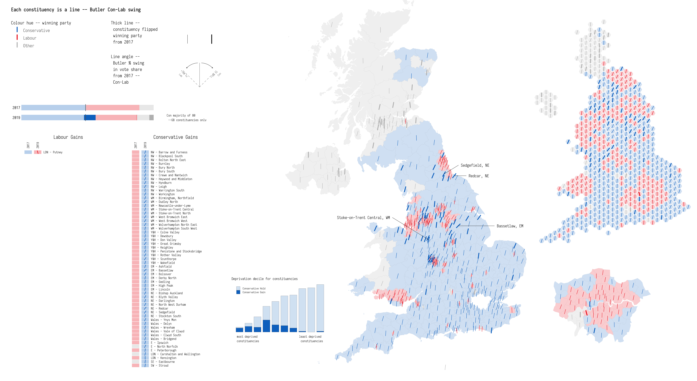
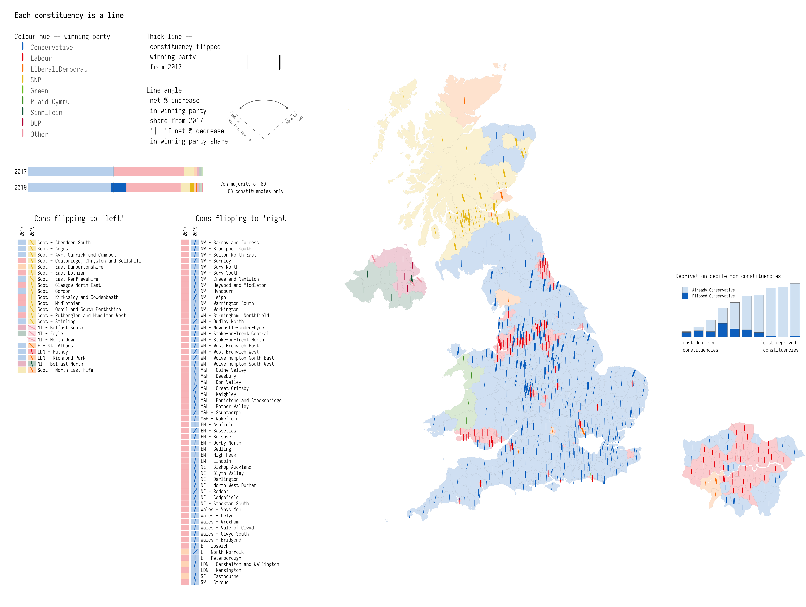

## Notes

This repository contains code and details for a data vis of 2019 UK General Election. The encoding is based on [Lazaro Gamio](https://twitter.com/LazaroGamio) and Dan Keating's excellent work [featured in Washington Post](https://www.washingtonpost.com/graphics/politics/2016-election/election-results-from-coast-to-coast/) analysing county-level voting outcomes for 2016 Presidential Election.

The data in this repository (found in [data/](data/)) is assembled from:

_Voting data_

* [Electoral Commission](https://www.electoralcommission.org.uk) : constituency-level result data.

* [YouGov](https://yougov.co.uk/topics/politics/articles-reports/2019/11/27/how-yougovs-2019-general-election-model-works) : constituency-level vote share estimates based on surveys from 100,000 panellists and an MRP model. Methods by [Benjamin Lauderdale](http://benjaminlauderdale.net/) and [Jack Blumenau](https://www.jackblumenau.com/).

* [Alex Denvir](https://twitter.com/eldenvo) -- pulled together unverified results in detail (necessary for calculating vote share by party). Available as a GoogleSheet [here](https://drive.google.com/file/d/19Z1YbmmjzDqMl2rzrk0XTfNrbRJDAMtU/view)

_Boundary data_

* [ONS Open Geography Portal](http://geoportal.statistics.gov.uk) : Constituency boundary data.
* [Northern Ireland SOA boundary data](https://www.nisra.gov.uk/publications/super-output-area-boundaries-gis-format)
* [Scottish Data Zone boundary data](https://borders.ukdataservice.ac.uk/easy_download_data.html?data=Scotland_dz_2001)
* [England & Wales LSOA boundary data](https://geoportal.statistics.gov.uk/datasets/lower-layer-super-output-areas-december-2011-generalised-clipped-boundaries-in-england-and-wales)

_Deprivation data and constituency data_

* [UK-wide deprivation estimates](https://bmjopen.bmj.com/content/6/11/e012750) : LSOA-level data (equivalents for Scotland and Northern Ireland) published in supplementary material.

* [Commons Library](https://github.com/alasdairrae/wpc) : For constituency-level population estimates.

---



---

## Required Libraries


```{r, install_libraries, eval=FALSE}
library(tidyverse)              # bundle of packages for data manipulation.
library(sf)                     # for working with geospatial data.

# theme_void makes view composition with annotate_custom and gridExtra easier.
theme_set(theme_void(base_family="Iosevka Light"))
```

## Load data

```{r, eval=FALSE}
# Read in data from 2017 and 2015 from Electoral Commission.
data <- read_csv("./data/data.csv")

# From 2017, recode parties.
# Recode speaker (Bercow) to Conservative
# Recode Democratic Unionist Party to DUP
# Recode Labour and Co-operative to Labour
# Recode Scottish National Party to SNP
# Recode UK Independence Party to UKIP
data <- data %>% mutate(
  party = case_when(
    party == "Speaker" ~ "Conservative", # speaker (Bercow) to Conservative
    party == "Democratic Unionist Party" ~ "DUP",
    party == "Labour and Co-operative" ~ "Labour",
    party == "Scottish National Party" ~ "SNP",
    party == "UK Independence Party" ~ "UKIP",
    party == "Liberal Democrats" ~ "Liberal Democrat",
    party == "Social Democratic and Labour Party" ~ "SDLP",
    party == "Ulster Unionist Party" ~ "UUP",
    party == "Green Party" ~ "Green",
    TRUE ~ as.character(party)),
    party=gsub("\\s", "_", party)
) %>%
  # Remove columns that are not needed.
  select(-c(pano, surname, first_name))

# Load in YouGov's MRP-based estimates for GB constituencies 2019.
data_estimated <- read_csv("./data/party_constituency_vote_shares_dec.csv") %>%
  rename("Conservative"="Con", "Labour"="Lab", "Liberal_Democrat" = "LD", "Plaid_Cymru" = "PC") %>%
  # Reshape dataset so it can be joined with Electoral Commission data.
  # Treating vote_share as counts is an odd formulation but necessary for later
  # data processing activity.
  pivot_longer(-c(code, constituency), names_to="party", values_to="valid_votes") %>%
  # Add a year column and rename code to ons_code.
  add_column(year=2019) %>% rename("ons_code"="code")

# Load in unverified result data.
data_2019 <- read_csv("./data/GE_2019_results.csv") %>%
  # Rename parties for consistency with 2017 data.
  rename("Conservative"="con", "Labour"="lab", "Liberal_Democrat" = "lib", "Plaid_Cymru" = "plc", "Brexit_Party"="brx", "DUP"="dup", "Other"="oth", "SDLP"="sdl", "SNP"="snp", "Independent"="ind", "Speaker"="spk", "UKIP"="ukp", "UUP"="uup", "Sinn_Fein"="snf", "Green"="grn", "Alliance"="all") %>%
  # Reshape dataset so it can be joined with Electoral Commission data.
  select(-c(electorate, turnout, winning_party, previous_party, gain, second_party, majority)) %>%
  pivot_longer(-c(code, constituency), names_to="party", values_to="valid_votes") %>%
  # Add a year column and rename code to ons_code.
  add_column(year=2019) %>% rename("ons_code"="code") %>%
  # Recode speaker to Labour.
  filter(valid_votes!=0) %>%
  mutate(party=if_else(party=="Speaker", "Labour", party))

# Load in outlines of constituencies -- simplified using mapshapr.
constituency_boundaries <- st_read("./data/constituency_boundaries.geojson", crs=27700)

# Load in Region lookup.
region_lookup <- read_csv("./data/constituency_region_lookup.csv")

# Check that winning parties in 2017 can be looked-up in winning parties for MRP data.
winners_2017 <- data %>%
  inner_join(region_lookup %>% select(ons_code=PCON17CD,region_name=EER17NM)) %>%
  group_by(ons_code) %>%
  mutate(
    total_votes=sum(valid_votes),
    first=max(valid_votes),
    is_first=if_else(valid_votes==first, 1, 0)
    ) %>%
  select(ons_code, constituency, party, is_first) %>%
  filter(is_first==1) %>% ungroup() %>% select(party) %>% unique

# Check that both match
(winners_2017 %>% pull(party)) %in% (data_2019 %>% pull(party) %>% unique)

# Check that winning parties in 2019 data can be looked-up in winning parties 2017 data.
winners_2019 <- data_2019 %>% 
  group_by(ons_code) %>%
  mutate(
    total_votes=sum(valid_votes),
    first=max(valid_votes),
    is_first=if_else(valid_votes==first, 1, 0)
    ) %>%
  filter(is_first==1) %>% ungroup() %>% select(party) %>% unique

# Check that both match.
(winners_2019 %>% pull(party)) %in% (data %>% pull(party) %>% unique)

# Recode the electoral commission data with Other category for consistency.
# Also remove 2015 data and non-GB constituencies.
elected_parties_names <- c("Conservative","Labour","Liberal_Democrat","Plaid_Cymru","Brexit_Party", "DUP", "Other", "SDLP", "SNP", "Independent", "Speaker", "UKIP", "UUP", "Sinn_Fein", "Green", "Alliance")
data <- data %>% inner_join(region_lookup %>% select(ons_code=PCON17CD,region_name=EER17NM)) %>% filter(year==2017) %>%
  mutate(party=if_else(party %in% elected_parties_names, party, "Other")) %>% select(-region_name) %>%
  group_by(ons_code, constituency, year, party) %>%
  summarise(valid_votes=sum(valid_votes))

# Merge 2019 and electoral commision data
data <- bind_rows(data_2019, data)

# Load LSOA boundary data for EW, NI and Scot -- for approximating deprivation to Constituency-level.
ni_boundaries <- st_read("./data/boundaries/SOA2011_Esri_Shapefile_0/SOA2011.shp") %>% st_transform(crs=27700) %>% select(geo_code=SOA_CODE)
scot_boundaries <- st_read("./data/boundaries/Scotland_dz_2001/scotland_dz_2001.shp") %>% st_transform(crs=27700) %>% select(geo_code=zonecode)
e_w_boundaries <- st_read("./data/boundaries/Lower_Layer_Super_Output_Areas_December_2011_Generalised_Clipped__Boundaries_in_England_and_Wales/Lower_Layer_Super_Output_Areas_December_2011_Generalised_Clipped__Boundaries_in_England_and_Wales.shp") %>% st_transform(crs=27700) %>% select(geo_code=lsoa11cd)
# Join NI, Scot and EW.
lsoa_cons <- rbind(
  ni_boundaries %>% mutate(geo_code=as.character(geo_code)), 
  scot_boundaries %>% mutate(geo_code=as.character(geo_code)), 
  e_w_boundaries %>% mutate(geo_code=as.character(geo_code))
  )
# Load LSOA-level deprivation data.
uk_deprivation <- read_delim("https://data.bris.ac.uk/datasets/1ef3q32gybk001v77c1ifmty7x/uk_imd_scores_data.txt", delim="\t")
# Join on boundary data.
uk_deprivation_spat <- inner_join(lsoa_cons, uk_deprivation, by=c("geo_code"="area_code"))
# Allocate LSOAs to contituencies -- nothing sophisticated here
# (not weighting LSOAs according to area proportion in constituency)
uk_deprivation_spat <- st_join(uk_deprivation_spat, constituency_boundaries)
# Ideally should weight according to popylation size. 
# E.g. : https://researchbriefings.parliament.uk/ResearchBriefing/Summary/CBP-7327
# Population data -- to be collected.
uk_deprivation_con <- uk_deprivation_spat %>% st_drop_geometry() %>%
  group_by(geo_code) %>% 
  mutate(weight=1, imd_adj=uk_imd_england_score*weight) %>% ungroup() %>% 
  group_by(pcon17cd) %>%
  summarise(imd=mean(imd_adj)) %>% ungroup() %>% mutate(decile=ntile(-imd, 10)) 

# Constituency-level population data.
pop_constituency <- read_csv("./data/constituency_age.csv") %>% rename(pop=`All Ages`) %>%
  group_by(PCON11CD) %>%
  summarise(pop=first(pop))
```

## Calculate derived measures for plotting

Calculate one-party shift and [Butler two party swing](https://en.wikipedia.org/wiki/Swing_(United_Kingdom)#Original_mathematical_calculation) for main parties for plotting.

```{r, eval=FALSE}
data_plot <- data %>% group_by(ons_code, year) %>%
  mutate(
    total_votes=sum(valid_votes),
    vote_share=valid_votes/total_votes,
    elected_share=max(vote_share),
    elected=if_else(vote_share==elected_share, party, "")) %>%  ungroup() %>%
  # Calculate one-party shift for party that was elected
  group_by(ons_code, party) %>%
  arrange(year, .by_group = TRUE) %>%
  mutate(
    elected_shift=if_else(elected==party, vote_share-lag(vote_share,1),0),
    # Identify whether winning party is flipped.
    is_flipped=if_else(elected==party, !elected==lag(elected,1),NA)
    ) %>% ungroup() %>%
  # Make wide again so that each column is a party.
  pivot_wider(names_from=party, values_from = vote_share) %>%
  mutate_at(vars(Conservative:Plaid_Cymru), ~if_else(is.na(.x),0,.x)) %>%
  group_by(ons_code, year, elected, is_flipped) %>%
  # Store derived values for the elected parties in constituency.
  summarise_at(vars(valid_votes, total_votes, elected_share, elected_shift, Conservative:Plaid_Cymru), ~max(.)) %>% ungroup () %>%
  # Filter so one row for each constituency-year.
  filter(elected!="") %>% 
  # Calculate shift from 2017.
  group_by(ons_code) %>%
  mutate_at(vars(Conservative:Plaid_Cymru), funs(shift=.-lag(.,1))) %>%
  mutate(elected_2017=lag(elected,1)) %>%
  filter(year==2019) %>% rename("elected_votes"="valid_votes") %>%
  # Calculate Butler two-party swing.
  mutate(
    swing_con_lab=0.5*(Conservative_shift-Labour_shift),
    swing_con_lib=0.5*(Conservative_shift-Liberal_Democrat_shift),
    swing_lib_lab=0.5*(Liberal_Democrat_shift-Labour_shift)
  ) 

# Join with boundary data.
data_plot  <- constituency_boundaries %>% select(ons_code=pcon17cd, east=bng_e, north=bng_n, cons_name=pcon17nm) %>%
  inner_join(data_plot)
# And bring in region codes.
data_plot <- data_plot %>% left_join(region_lookup %>% select(region_name=EER17NM, PCON17CD), by=c("ons_code"="PCON17CD")) %>%
  # And generate shortened region_name for plotting
 mutate(region_name_short=case_when(
    region_name == "Scotland" ~ "Scot",
    region_name == "Northern Ireland" ~ "NI",
    region_name == "Wales" ~ "Wales",
    region_name == "North West" ~ "NW",
    region_name == "North East" ~ "NE",
    region_name == "Yorkshire and The Humber" ~ "Y&H",
    region_name == "West Midlands" ~ "WM",
    region_name == "East Midlands" ~ "EM",
    region_name == "Eastern" ~ "E",
    region_name == "South West" ~ "SW",
    region_name == "South East" ~ "SE",
    region_name == "London" ~ "LDN"
  ))

# Manually set the speaker's constituency E14000637.
data_plot <- data_plot %>%
  mutate(
    is_flipped=if_else(ons_code=="E14000637",FALSE, is_flipped),
    elected_shift=if_else(ons_code=="E14000637",0, elected_shift))
```

## Colours

Selecting colours is challenging -- I'm borrowing from [Flourish's](https://flourish.studio/2019/11/26/charts-for-the-uk-elections-2019/) colour set.

```{r, eval=FALSE}
# Con :
con <- "#0575c9"
# Lab :
lab <- "#ed1e0e"
# Lib dem :
lib_dem <- "#fe8300"
# SNP :
snp <- "#ebc31c"
# Greens :
greens <- "#78c31e"
# plaid
plaid <- "#4e9f2f"
# sinn fein
sinn_fein <- rgb(10, 98, 64, max=255)
# dup 
dup <- rgb(190, 26, 64, max=255)
# Other :
other <- "#bdbdbd"

elected_parties_colours <- c("Conservative","Labour","Liberal_Democrat","SNP", "Green", "Plaid_Cymru", "Sinn_Fein", "DUP")
# Recode elected paty as Other if doesn't have a colour.
data_plot <- data_plot %>% mutate(elected=if_else(elected %in% elected_parties_colours, elected, "Other"))
# Store as vector and recode elected variable as factor for use in scale_colour_manual.
data_plot <- data_plot %>%
  mutate(
  elected=fct_relevel(as_factor(elected), levels=c("Conservative","Labour","Liberal_Democrat","SNP", "Green", "Plaid_Cymru", "Sinn_Fein", "DUP", "Other"))
)
colours <- c(con, lab, lib_dem, snp, greens, plaid, sinn_fein, dup, other)
names(colours) <- levels(data_plot$elected)
```


## Use of _geom_spoke()_

To continuously vary line angle (as in [Washington Post piece](https://www.washingtonpost.com/graphics/politics/2016-election/election-results-from-coast-to-coast/)), I'm using `geom_spoke()`. Couple of additional convenience functions are below.

```{r, eval=FALSE}
# Convert degrees to radians.
get_radians <- function(degrees) {
  (degrees * pi) / (180)
}
# Rescaling function.
map_scale <- function(value, min1, max1, min2, max2) {
  return  (min2+(max2-min2)*((value-min1)/(max1-min1)))
}

# Position subclass for centred geom_spoke as per --
# https://stackoverflow.com/questions/55474143/how-to-center-geom-spoke-around-their-origin
position_center_spoke <- function() PositionCenterSpoke
PositionCenterSpoke <- ggplot2::ggproto('PositionCenterSpoke', ggplot2::Position,
    compute_panel = function(self, data, params, scales) {
      data$x <- 2*data$x - data$xend
      data$y <- 2*data$y - data$yend
      data$radius <- 2*data$radius
      data
  }
)
```


## Generate legend with _annotation_custom()_

```{r, eval=FALSE}
# Use of angle to encode swing.
swing <-  ggplot()+
  geom_spoke(aes(x=0, y=-.35,angle=get_radians(90)),radius=0.55, size=0.2, colour="#636363", lineend="round")+
  geom_spoke(aes(x=0, y=-.35,angle=get_radians(135)),radius=0.55, size=0.2,colour="#636363", linetype = "dashed", lineend="round")+
  geom_spoke(aes(x=0, y=-.35,angle=get_radians(45)),radius=0.55,size=0.2,colour="#636363",linetype = "dashed", lineend="round")+
  geom_text(aes(label="+36% to \n Con",x=.45, y=0), angle=45,hjust="right", family="Iosevka Light", size=2, colour="#636363")+
  geom_text(aes(label="+36% to \n Lab, Lib, Grn, SNP",x=-.45, y=0), angle=315,hjust="left", family="Iosevka Light", size=2, colour="#636363")+
  geom_curve(aes(x=-.04, y=.2, xend=-.3, yend=.08), size=0.3, curvature = 0.2, arrow=arrow(type="closed", length = unit(.03, "inches")), colour="#636363")+
  geom_curve(aes(x=.04, y=.2, xend=.3, yend=.08), size=0.3, curvature = -0.2, arrow=arrow(type="closed", length = unit(.03, "inches")), colour="#636363")+
  xlim(-0.5,0.5)+
  ylim(-0.35,0.35)
# Use of colour to encode party.
temp_dat <-tibble(
  elected=names(colours[1:9]),
  y=rev(1:length(colours[1:9])),
  x=rep(1,length(colours[1:9]))
)
party <- temp_dat %>%
  ggplot()+
  geom_spoke(aes(x=x, y=y,angle=get_radians(90), colour=elected),radius=0.6, size=1, lineend="round")+
  scale_colour_manual(values=colours)+
  geom_text(aes(label=elected,x=x+0.05, y=y+0.2),hjust="left",vjust="middle", family="Iosevka Light", size=3.5, colour="#636363")+
    guides(colour=FALSE)+
  xlim(1,2)+
  ylim(1,10)
# Use of thickness to flips.
line <-  ggplot()+
  geom_spoke(aes(x=-0.2, y=-.35,angle=get_radians(90)),radius=0.55, size=0.2, lineend="round")+
  geom_spoke(aes(x=0.2, y=-.35,angle=get_radians(90)),radius=0.55, size=0.8, lineend="round")+
  xlim(-0.5,0.5)+
  ylim(-0.35,0.35)

legend <- ggplot()+
  geom_text(aes(label="Each constituency is a line",x=0, y=6), hjust="left", vjust="top", family="Iosevka Medium", size=4)+
  geom_text(aes(label="Colour hue -- winning party",x=0, y=5), hjust="left", vjust="top", family="Iosevka Light", size=3.5)+
  geom_text(aes(label="Thick line -- \n constituency flipped \n winning party \n from 2017",x=4.5, y=5), hjust="left", vjust="top", family="Iosevka Light", size=3.5)+
  geom_text(aes(label="Line angle -- \n net % increase \n in winning party \n share from 2017 \n '|' if net % decrease \n in winning party share",x=4.5, y=2.5), hjust="left", vjust="top", family="Iosevka Light", size=3.5)+
  annotation_custom(grob=ggplotGrob(swing),xmin=7,xmax=10,ymin=0,ymax=2.5)+
  annotation_custom(ggplotGrob(line),xmin=7,xmax=10,ymin=4.2,ymax=3.3)+
  annotation_custom(ggplotGrob(party),xmin=0,xmax=6,ymin=0,ymax=5)+
  xlim(0,10)+
  ylim(0,6.25)
```


## Generate map with _geom_spoke()_ and _geom_sf()_

```{r, eval=FALSE}
# Only shift overall vote if the winning party sees an increase in vote-share.
max_shift <- max(data_plot$elected_shift)
min_shift <- -max_shift
# Calculate bounding boxes for use in annotation_custom().
london_bbox <- st_bbox(data_plot %>% filter(region_name=="London"))
london_width <- unname(london_bbox$xmax)-unname(london_bbox$xmin)
london_height <- unname(london_bbox$ymax)-unname(london_bbox$ymin)
london_aspect <- london_width/london_height
uk_bbox <- st_bbox(data_plot)
uk_width <- unname(uk_bbox$xmax)-unname(uk_bbox$xmin)
uk_height <- unname(uk_bbox$ymax)-unname(uk_bbox$ymin)
# GB map.
gb <- data_plot %>%
  filter(region_name!="London") %>%
  ggplot()+
  geom_sf(aes(fill=elected), colour="#636363", alpha=0.2, size=0.01)+
  coord_sf(crs=27700, datum=NA, xlim = c(unname(uk_bbox$xmin), unname(uk_bbox$xmax)+5*london_width), ylim = c(unname(uk_bbox$ymin), unname(uk_bbox$ymax)-0.22*uk_height))+
  # Flipped
  geom_spoke(data=.%>% filter(is_flipped, elected %in% c("Conservative")),
     aes(x=east, y=north, angle=get_radians(map_scale(pmax(elected_shift,0),min_shift,max_shift,135,45)), colour=elected), radius=7000, size=0.9, position="center_spoke", lineend="round")+
  geom_spoke(data=. %>% filter(is_flipped, !elected %in% c("Conservative")),
     aes(x=east, y=north, angle=get_radians(map_scale(pmax(elected_shift,0),min_shift,max_shift,45,135)), colour=elected), radius=7000, size=0.9, position="center_spoke", lineend="round")+
  # Not flipped
   geom_spoke(data=. %>% filter(!is_flipped, elected %in% c("Conservative")),
     aes(x=east, y=north, angle=get_radians(map_scale(pmax(elected_shift,0),min_shift,max_shift,135,45)), colour=elected), radius=7000, size=0.3, position="center_spoke", lineend="round")+
  geom_spoke(data=. %>% filter(!is_flipped, !elected %in% c("Conservative")),
     aes(x=east, y=north, angle=get_radians(map_scale(pmax(elected_shift,0),min_shift,max_shift,45,135)), colour=elected), radius=7000, size=0.3, position="center_spoke", lineend="round")+
  scale_colour_manual(values=colours)+
  scale_fill_manual(values=colours)+
    guides(colour=FALSE, fill=FALSE)

london <- data_plot %>%
  filter(region_name=="London") %>%
  ggplot()+
  geom_sf(aes(fill=elected), colour="#636363", alpha=0.2, size=0.01)+
  coord_sf(datum=NA)+
  # Flipped
  geom_spoke(data=.%>% filter(is_flipped, elected %in% c("Conservative")),
     aes(x=east, y=north, angle=get_radians(map_scale(pmax(elected_shift,0),min_shift,max_shift,135,45)), colour=elected), radius=7000/6, size=0.9, position="center_spoke", lineend="round")+
  geom_spoke(data=.%>% filter(is_flipped, !elected %in% c("Conservative")),
     aes(x=east, y=north, angle=get_radians(map_scale(pmax(elected_shift,0),min_shift,max_shift,45,135)), colour=elected), radius=7000/6, size=0.9, position="center_spoke", lineend="round")+
  # Not flipped
   geom_spoke(data=.%>% filter(!is_flipped, elected %in% c("Conservative")),
     aes(x=east, y=north, angle=get_radians(map_scale(pmax(elected_shift,0),min_shift,max_shift,135,45)), colour=elected), radius=7000/6, size=0.3, position="center_spoke", lineend="round")+
  geom_spoke(data=.%>% filter(!is_flipped, !elected %in% c("Conservative")),
     aes(x=east, y=north, angle=get_radians(map_scale(pmax(elected_shift,0),min_shift,max_shift,45,135)), colour=elected), radius=7000/6, size=0.3, position="center_spoke", lineend="round")+
  scale_colour_manual(values=colours)+
  scale_fill_manual(values=colours)+
  guides(colour=FALSE, fill=FALSE)

map <- gb +
  annotation_custom(
       grob=ggplotGrob(london),
       xmin=unname(uk_bbox$xmax) + 1*london_width,
       xmax=unname(uk_bbox$xmax) + 6*london_width,
       ymin=unname(uk_bbox$ymin) - 1*london_height,
       ymax=unname(uk_bbox$ymin) + 6*london_height
   ) +
  annotation_custom(
       grob=ggplotGrob(flipped_by_decile),
       xmin=unname(uk_bbox$xmax) + 1*london_width,
       xmax=unname(uk_bbox$xmax) + 5.8*london_width,
       ymin=unname(uk_bbox$ymin) + 0.3*uk_height,
       ymax=unname(uk_bbox$ymin) + 0.45*uk_height
   ) 
```

## Generate summary of flips

```{r, eval=FALSE}
flips_data <- data_plot %>%
  filter(is_flipped) %>%
  mutate(flip_direction = if_else(elected %in% c("Conservative"),"Cons flipping to 'right'","Cons flipping to 'left'")) %>%
  group_by(region_name, elected) %>%
  mutate(number_flips=n()) %>% ungroup() %>%
  group_by(flip_direction) %>%
  # For constituencies ordered by flip_direction and regions with greatest number of flips
  arrange(flip_direction, desc(number_flips), region_name) %>% mutate(row=row_number()) %>% ungroup() %>%
  mutate(facet_rows= case_when(row / 100 <1 ~ 1,row / 100 <2 ~ 2),
         max_row=max(row))

flips <- flips_data %>%
  ggplot()+
   # Elected 2017
  geom_rect(aes(xmin=0.7, xmax=1.3, ymin=-row-0.5, ymax=-row+0.5, fill=elected_2017),colour="#ffffff", size=0.3, alpha=0.3)+
   # Elected 2019 
  geom_rect(aes(xmin=1.4, xmax=2.0, ymin=-row-0.5, ymax=-row+0.5, fill=elected),colour="#ffffff", size=0.3, alpha=0.3)+
  # Flipped
   geom_spoke(data=. %>% filter(is_flipped, elected %in% c("Conservative")),
     aes(x=1.7, y=-row, angle=get_radians(map_scale(pmax(elected_shift,0),min_shift,max_shift,135,45)), colour=elected), radius=0.4, size=0.5, position="center_spoke", lineend="round")+
    geom_spoke(data=. %>% filter(is_flipped==TRUE, !elected %in% c("Conservative")),
       aes(x=1.7, y=-row, angle=get_radians(map_scale(pmax(elected_shift,0),min_shift,max_shift,45,135)), colour=elected), radius=0.4, size=0.5, position="center_spoke", lineend="round")+
  geom_text(aes(x=2.1, y=-row, label=paste0(region_name_short," - ",cons_name)), hjust="left", size=2.5, family="Iosevka Light")+
  geom_text(data=. %>% filter(flip_direction=="Cons flipping to 'right'") %>% slice(1), aes(label=flip_direction), x=5, y=3, hjust="centre", family="Iosevka Light") +
  geom_text(data=. %>% filter(flip_direction=="Cons flipping to 'left'") %>% slice(1), aes(label=flip_direction), x=5, y=3, hjust="centre", family="Iosevka Light") +
  geom_text(data=. %>% filter(flip_direction=="Cons flipping to 'right'") %>% slice(1), label="2017", x=1.0, y=0, hjust="left", size=2.5, angle=90, family="Iosevka Light") +
  geom_text(data=. %>% filter(flip_direction=="Cons flipping to 'right'") %>% slice(1), label="2019", x=1.7, y=0, hjust="left", size=2.5, angle=90, family="Iosevka Light") +
   geom_text(data=. %>% filter(flip_direction=="Cons flipping to 'left'") %>% slice(1), label="2017", x=1.0, y=0, hjust="left", size=2.5, angle=90, family="Iosevka Light") +
  geom_text(data=. %>% filter(flip_direction=="Cons flipping to 'left'") %>% slice(1), label="2019", x=1.7, y=0, hjust="left", size=2.5, angle=90, family="Iosevka Light") +
  xlim(0,10)+
  ylim(-(max(flips_data$max_row)+1), 4)+
  facet_wrap(~flip_direction)+
   scale_colour_manual(values=colours)+
  scale_fill_manual(values=colours)+
  guides(colour=FALSE, fill=FALSE)+
  theme(strip.text = element_blank())
````

## Generate vote by constituency plot

```{r, eval=FALSE}
counts_by_party <- data_plot %>% st_drop_geometry() %>% select(elected, elected_2017, is_flipped, cons_name) %>% 
  pivot_longer(-c(is_flipped, cons_name), names_to="year", values_to="party_name") %>% 
  mutate(year=if_else(year=="elected", 2019,2017), is_flipped=if_else(year==2017,FALSE, is_flipped), party_name=if_else(party_name=="Independent", "Other", party_name)) %>%
  group_by(year, party_name) %>%
  mutate(num_elected=n()) %>% ungroup() %>% group_by(year) %>%
  arrange(desc(num_elected), is_flipped) %>% 
  mutate(row=row_number(), majority=if_else(row==1, num_elected-(max(row)-num_elected),row)) %>% ungroup() %>% 
  ggplot()+
  geom_rect(data=. %>% filter(is_flipped), aes(ymin=.1, ymax=.9, xmin=row-0.5, xmax=row+0.5, fill=party_name))+
 geom_rect(data=. %>% filter(!is_flipped), aes(ymin=.1, ymax=.9, xmin=row-0.5, xmax=row+0.5, fill=party_name), alpha=0.3)+
  geom_segment(data=. %>% filter(row==316), y=0, x=316, yend=1, xend=316, colour="#636363", size=0.5, alpha=0.9)+
  geom_text(data=. %>% filter(row==1 | row==323), aes(label=year), x=-5, y=0.5, hjust="right", vjust="middle", size=3, family="Iosevka Light")+
  geom_text(data=. %>% filter(row==1, year==2019), aes(label=paste0("Con majority of ",majority, "\n --GB constituencies only"), x=1.1*nrow(data_plot)), y=0.5, hjust="left", vjust="middle", size=2.5, family="Iosevka Light")+
  ylim(0,1)+
  xlim(-50, 1.6*nrow(data_plot))+
  scale_colour_manual(values=colours)+
  scale_fill_manual(values=colours)+
  facet_wrap(~year, nrow=2)+
  guides(colour=FALSE, fill=FALSE)+
  theme(strip.text = element_blank())
```


## Show flipped constituencies by deprivation declile

```{r, eval=FALSE}
# Join constituency deprivation data.
data_plot <- data_plot %>%
  left_join(uk_deprivation_con, by=c("ons_code"="pcon17cd"))

flipped_colours = c(rgb(216, 230, 244, max=255), rgb(6,117,201, max=255))

# Bars -- Con flips compared to overall Con on deprivation.
flipped_by_decile <- data_plot %>% 
  mutate(is_flipped=if_else(is_flipped, "Flipped Conservative", "Already Conservative")) %>% 
  ggplot()+
  geom_bar(data=. %>% filter(elected=="Conservative"), aes(decile, fill=is_flipped), colour="#636363", size=0.1, width=0.8 )+
  geom_text(data=. %>% slice(1), aes(label="most deprived \nconstituencies", x=0.7, y=-4), hjust="left", vjust="top", size=2.5, family="Iosevka Light")+
  geom_text(data=. %>% slice(1), aes(label="least deprived \nconstituencies", x=10.3, y=-4), hjust="right", vjust="top", size=2.5, family="Iosevka Light")+
  scale_fill_manual(values=flipped_colours)+
  ylim(-15,60)+
  labs(subtitle="Deprivation decile for constituencies")+
  theme(
    legend.title=element_blank(),
    legend.position = c(0.05, 0.95),
    legend.justification = c("left", "top"),
    legend.key.size = unit(0.3, "cm"),
    legend.text = element_text(size=6),
    title = element_text(size=8)
  )
```

## Compose views and export

View composition in `ggplot2` is not as easy and elegant as in [vega-lite](https://vega.github.io/vega-lite/), but I'm using `gridExtra::grid.arrange()` and some fiddly trial and error work.

```{r, eval=FALSE}
out <- gridExtra::grid.arrange(legend,counts_by_party, flips,map,
                    widths = c(0.4, 0.6),
                    heights = c(0.25,0.03, 0.047,0.7),
                    layout_matrix = rbind(c(1,4),c(NA,4),c(2,4) ,c(3,4))
)
ggsave("./figures/all_shift.png",plot = out, width=40, height=30.15, units="cm")
```



## Generate triangle with _geom_segment()_

```{r, eval=FALSE}
# Vary width (votes cast) and height (margin in net votes) of triangle.
triangle <-  ggplot()+
  geom_segment(aes(x=-.4, xend=0, y=-.35, yend=0.35), size=0.2, colour="#636363", lineend="round")+
  geom_segment(aes(x=.4, xend=0, y=-.35, yend=0.35), size=0.2, colour="#636363", lineend="round")+
  geom_segment(aes(x=0, y=-.32, xend=0, yend=.32), size=0.1, arrow=arrow(type="closed", ends="both", length = unit(.05, "inches")), linetype = "dashed", colour="#636363")+
  geom_segment(aes(x=-.34, y=-.35, xend=.34, yend=-.35), size=0.1, arrow=arrow(type="closed", ends="both", length = unit(.05, "inches")), linetype = "dashed", colour="#636363")+
  geom_text(aes(label="Height is \npop density",x=0, y=-.1),hjust="centre", family="Iosevka Light", size=2.5, colour="#636363")+
  geom_text(aes(label="Width is % share of vote",x=0, y=-.45),hjust="centre", family="Iosevka Light", size=2.5, colour="#636363")+
  xlim(-0.5,0.5)+
  ylim(-0.5,0.35)
# Use of colour to encode party.
temp_dat <-tibble(
  elected=names(colours[1:9]),
  y=rev(1:length(colours[1:9])),
  x=rep(1,length(colours[1:9]))
)
party <- temp_dat %>%
  ggplot()+
  geom_segment(aes(x=x-.03, xend=x, y=y-.08, yend=y+.4, colour=elected), size=0.6, lineend="round")+
  geom_segment(aes(x=x+.03, xend=x, y=y-.08, yend=y+.4, colour=elected), size=0.6, lineend="round")+
  scale_colour_manual(values=colours)+
  geom_text(aes(label=elected,x=x+0.05, y=y+0.2),hjust="left",vjust="middle", family="Iosevka Light", size=3.5, colour="#636363")+
    guides(colour=FALSE)+
  xlim(0.95,2)+
  ylim(0.7,10)
# Use of thickness to flips.
line <-  ggplot()+
  geom_segment(aes(x=-0.3-.15, xend=-0.3, y=-.35, yend=.2), size=0.2)+
  geom_segment(aes(x=-0.3+.15, xend=-0.3, y=-.35, yend=.2), size=0.2)+
  geom_segment(aes(x=0.35-.15, xend=0.35, y=-.35, yend=.2), size=0.6)+
  geom_segment(aes(x=0.35+.15, xend=0.35, y=-.35, yend=.2), size=0.6)+
  xlim(-0.6,0.7)+
  ylim(-0.35,0.35)

legend <- ggplot()+
  geom_text(aes(label="Each constituency is a triangle",x=0, y=6), hjust="left", vjust="top", family="Iosevka Medium", size=4)+
  geom_text(aes(label="Colour hue -- winning party",x=0, y=5), hjust="left", vjust="top", family="Iosevka Light", size=3.5)+
  geom_text(aes(label="Thick line -- \n constituency won \n in landslide \n (60% +)",x=4.5, y=5), hjust="left", vjust="top", family="Iosevka Light", size=3.5)+
  geom_text(aes(label="Width -- \n % share of vote \n in winning party \nHeight -- \n pop density \n of constituency",x=4.5, y=2.5), hjust="left", vjust="top", family="Iosevka Light", size=3.5)+
  annotation_custom(grob=ggplotGrob(triangle),xmin=7,xmax=10,ymin=0,ymax=2.5)+
  annotation_custom(ggplotGrob(line),xmin=7,xmax=10,ymin=4.2,ymax=3.3)+
  annotation_custom(ggplotGrob(party),xmin=0,xmax=6,ymin=0,ymax=5)+
  xlim(0,10)+
  ylim(0,6.25)
```


## Generate map with _geom_segment()_ and _geom_sf()_

```{r, eval=FALSE}
# Add population density variable.
data_plot <- data_plot %>% 
  # Add areas.
  mutate(area=data_plot %>% st_area() %>% units::drop_units() ) %>%
  # Add population sizes.
  left_join(pop_constituency, by=c("ons_code"="PCON11CD")) %>%
  mutate(pop_density=pop/area)
# Identify landslide constituencies
data_plot <- data_plot %>% 
  mutate(is_landslide=elected_share>.6, pop_density=(pop/area)^1.8)
# Min/max for scaling -- data values
min_density <- min(data_plot$pop_density)
max_density <- max(data_plot$pop_density)
min_share <- min(data_plot$elected_share)
max_share <- max(data_plot$elected_share)
# Min/max for scaling -- geog values
min_height <- 3000
max_height <- 3000*50
min_width <- 1500
max_width <- 1500*5

# Calculate bounding boxes for use in annotation_custom().
london_bbox <- st_bbox(data_plot %>% filter(region_name=="London"))
london_width <- unname(london_bbox$xmax)-unname(london_bbox$xmin)
london_height <- unname(london_bbox$ymax)-unname(london_bbox$ymin)
london_aspect <- london_width/london_height
uk_bbox <- st_bbox(data_plot)
uk_width <- unname(uk_bbox$xmax)-unname(uk_bbox$xmin)
uk_height <- unname(uk_bbox$ymax)-unname(uk_bbox$ymin)
# GB map.
gb <- data_plot %>%
  filter(region_name!="London") %>%
  mutate(
    width=map_scale(elected_share, min_share, max_share, min_width, max_width),
    height=map_scale(pop_density, min_density, max_density, min_height, max_height)
  ) %>% 
  ggplot()+
  geom_sf(aes(fill=elected), colour="#636363", alpha=0.2, size=0.01)+
  coord_sf(crs=27700, datum=NA, xlim = c(unname(uk_bbox$xmin), unname(uk_bbox$xmax)+5*london_width), ylim = c(unname(uk_bbox$ymin), unname(uk_bbox$ymax)-0.22*uk_height))+
  # Landslide
  geom_segment(data=.%>% filter(is_landslide),
     aes(x=east-width, xend=east, y=north, yend=north+height, colour=elected), size=0.8, alpha=0.8, lineend="round")+
  geom_segment(data=.%>% filter(is_landslide),
     aes(x=east+width, xend=east, y=north, yend=north+height, colour=elected), size=0.8, alpha=0.8, lineend="round")+
  # Not landslide
   geom_segment(data=.%>% filter(!is_landslide),
     aes(x=east-width, xend=east, y=north, yend=north+height, colour=elected), size=0.3, alpha=0.8, lineend="round")+
  geom_segment(data=.%>% filter(!is_landslide),
     aes(x=east+width, xend=east, y=north, yend=north+height, colour=elected), size=0.3, alpha=0.8, lineend="round")+
  scale_colour_manual(values=colours)+
  scale_fill_manual(values=colours)+
    guides(colour=FALSE, fill=FALSE)

london <- data_plot %>%
  filter(region_name=="London") %>%
  mutate(
    width=map_scale(elected_share, min_share, max_share, min_width, max_width)/6,
    height=map_scale(pop_density, min_density, max_density, min_height, max_height)/6
  ) %>% 
  ggplot()+
  geom_sf(aes(fill=elected), colour="#636363", alpha=0.2, size=0.01)+
  coord_sf(datum=NA)+
  # Landslide
  geom_segment(data=.%>% filter(is_landslide),
     aes(x=east-width, xend=east, y=north, yend=north+height, colour=elected), size=0.8, alpha=0.8, lineend="round")+
  geom_segment(data=.%>% filter(is_landslide),
     aes(x=east+width, xend=east, y=north, yend=north+height, colour=elected), size=0.8, alpha=0.8, lineend="round")+
  # Not landslide
   geom_segment(data=.%>% filter(!is_landslide),
     aes(x=east-width, xend=east, y=north, yend=north+height, colour=elected), size=0.3, alpha=0.8, lineend="round")+
  geom_segment(data=.%>% filter(!is_landslide),
     aes(x=east+width, xend=east, y=north, yend=north+height, colour=elected), size=0.3, alpha=0.8, lineend="round")+
  scale_colour_manual(values=colours)+
  scale_fill_manual(values=colours)+
  guides(colour=FALSE, fill=FALSE)

map <- gb +
  annotation_custom(
       grob=ggplotGrob(london),
       xmin=unname(uk_bbox$xmax) + 1*london_width,
       xmax=unname(uk_bbox$xmax) + 6*london_width,
       ymin=unname(uk_bbox$ymin) - 1*london_height,
       ymax=unname(uk_bbox$ymin) + 6*london_height
   ) 
```

## Compose views and export

```{r, eval=FALSE}
out <- gridExtra::grid.arrange(legend,map,
                    widths = c(0.4, 0.6),
                    heights = c(0.25,0.03, 0.047,0.7),
                    layout_matrix = rbind(c(1,2),c(NA,2),c(NA,2) ,c(NA,2))
)
ggsave("./figures/all_size.png",plot = out, width=40, height=30.15, units="cm")
```
