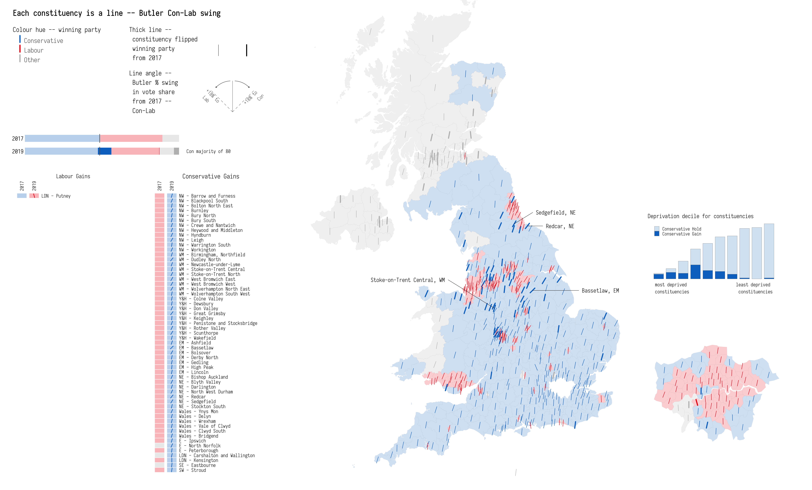

---



---

This repository contains code and details for a data vis of 2019 UK General Election. The encoding is based on [Lazaro Gamio](https://twitter.com/LazaroGamio) and Dan Keating's excellent work [featured in Washington Post](https://www.washingtonpost.com/graphics/politics/2016-election/election-results-from-coast-to-coast/) analysing county-level voting outcomes for 2016 Presidential Election.

The work is published as a [Featured Graphic in _Environment and Planning A_](https://doi.org/10.1177/0308518X20909392).

The data in this repository (found in [data/](data/)) is assembled from:

_Voting data_

* [Electoral Commission](https://www.electoralcommission.org.uk) : constituency-level result data.

* [Alex Denvir](https://twitter.com/eldenvo) -- pulled together unverified results in detail (necessary for calculating vote share by party). Available as a GoogleSheet [here](https://drive.google.com/file/d/19Z1YbmmjzDqMl2rzrk0XTfNrbRJDAMtU/view).

_Boundary data_

* [ONS Open Geography Portal](http://geoportal.statistics.gov.uk) : Constituency boundary data.
* [Northern Ireland SOA boundary data](https://www.nisra.gov.uk/publications/super-output-area-boundaries-gis-format)
* [Scottish Data Zone boundary data](https://borders.ukdataservice.ac.uk/easy_download_data.html?data=Scotland_dz_2001)
* [England & Wales LSOA boundary data](https://geoportal.statistics.gov.uk/datasets/lower-layer-super-output-areas-december-2011-generalised-clipped-boundaries-in-england-and-wales)

_Deprivation data and constituency data_

* [UK-wide deprivation estimates](https://bmjopen.bmj.com/content/6/11/e012750) : LSOA-level data (equivalents for Scotland and Northern Ireland) published in supplementary material.

* [Commons Library](https://github.com/alasdairrae/wpc) : For constituency-level population estimates.

The graphics were generated exclusively using the [ggplot2](https://ggplot2.tidyverse.org/) library. There was a fair bit of fiddly trial and error work here -- lots of idosyncratic sizing etc. However, fundamentally they are generated high-level declaratively and with [grammar of graphics](https://www.springer.com/gp/book/9780387245447)-style thinking.


## Required Libraries


```{r, install_libraries, eval=FALSE}
library(tidyverse)              # bundle of packages for data manipulation.
library(sf)                     # for working with geospatial data.

# theme_void makes view composition with annotate_custom and gridExtra easier.
theme_set(theme_void(base_family="Iosevka Light"))
```

## Load data

In the [code/](code/) folder is a script for reading in the results data, boundary data and UK-wide small area deprivation data that is then aggregated at the constituency-level. Rather than expose these details in this top-level `README`, we will simply execute this code using `source(<file-path>)`.

```{r, eval=FALSE}
source("code/load_data.R")
```

## Calculate derived measures for plotting

A key measure used to characterise shifting voting preference in the graphic is [Butler two-party Swing](https://en.wikipedia.org/wiki/Swing_(United_Kingdom)#Original_mathematical_calculation). The measure requires a little interpretation: it represents the average change in share of the vote won by two parties contesting successive elections. So in this case this means mostly adding the rise in the Conservative’s vote share and fall in Labour’s vote share between 2017 and 2019 and dividing by two. However, a swing to the  Conservatives from Labour could actually manifest in three ways:

* an increase in Conservative vote share and a decrease in Labour vote share
* an increase in both Conservative and Labour vote share, but with the Conservative increase outstripping that of Labour’s
* a decrease in both Conservative and Labour vote share, but with the Conservative decline being less severe than that of Labour's


Below we generate a new dataframe (`data_plot`) storing this derived measure, join this to the boundary data and make a few edits for plotting purposes (for example abbreviating Region names).

```{r, eval=FALSE}
data_plot <- data %>% group_by(ons_code, year) %>%
  mutate(
    total_votes=sum(valid_votes),
    vote_share=valid_votes/total_votes,
    elected_share=max(vote_share),
    elected=if_else(vote_share==elected_share, party, "")) %>%  ungroup() %>%
  # Calculate one-party shift for party that was elected
  group_by(ons_code, party) %>%
  arrange(year, .by_group = TRUE) %>%
  mutate(
    elected_shift=if_else(elected==party, vote_share-lag(vote_share,1),0),
    # Identify whether winning party is flipped.
    is_flipped=if_else(elected==party, !elected==lag(elected,1),NA)
    ) %>% ungroup() %>%
  # Make wide again so that each column is a party.
  pivot_wider(names_from=party, values_from = vote_share) %>%
  mutate_at(vars(Conservative:Plaid_Cymru), ~if_else(is.na(.x),0,.x)) %>%
  mutate(is_flipped=as.integer(is_flipped), is_flipped=if_else(is.na(is_flipped), as.integer(-1),is_flipped)) %>%
  group_by(ons_code, year) %>% # elected, is_flipped
  # Store derived values for the elected parties in constituency.
  summarise_at(vars(valid_votes, total_votes, elected_share, elected_shift, Conservative:Plaid_Cymru, elected, is_flipped), ~max(.)) %>% ungroup () %>%
  # Filter so one row for each constituency-year.
  filter(elected!="") %>% 
  # Calculate shift from 2017.
  group_by(ons_code) %>%
  mutate_at(vars(Conservative:Plaid_Cymru), funs(shift=.-lag(.,1))) %>%
  mutate(elected_2017=lag(elected,1)) %>%
  filter(year==2019) %>% rename("elected_votes"="valid_votes") %>%
  # Calculate Butler two-party swing.
  mutate(
    swing_con_lab=0.5*(Conservative_shift-Labour_shift),
    swing_con_lib=0.5*(Conservative_shift-Liberal_Democrat_shift),
    swing_lib_lab=0.5*(Liberal_Democrat_shift-Labour_shift),
    # Recast is_flipped as boolean
    is_flipped=is_flipped>0,
    # Recode Chorley (uncontested seat) to 0.
    swing_con_lab=if_else(ons_code=="E14000637",0,swing_con_lab)
  ) 

# Join with boundary data.
data_plot  <- constituency_boundaries %>% select(ons_code=pcon17cd, east=bng_e, north=bng_n, cons_name=pcon17nm) %>%
  inner_join(data_plot)
# And bring in region codes.
data_plot <- data_plot %>% left_join(region_lookup %>% select(region_name=EER17NM, PCON17CD), by=c("ons_code"="PCON17CD")) %>%
  # And generate shortened region_name for plotting.
 mutate(region_name_short=case_when(
    region_name == "Scotland" ~ "Scot",
    region_name == "Northern Ireland" ~ "NI",
    region_name == "Wales" ~ "Wales",
    region_name == "North West" ~ "NW",
    region_name == "North East" ~ "NE",
    region_name == "Yorkshire and The Humber" ~ "Y&H",
    region_name == "West Midlands" ~ "WM",
    region_name == "East Midlands" ~ "EM",
    region_name == "Eastern" ~ "E",
    region_name == "South West" ~ "SW",
    region_name == "South East" ~ "SE",
    region_name == "London" ~ "LDN"
  ))

# Manually set the speaker's constituency E14000637.
data_plot <- data_plot %>%
  mutate(
    is_flipped=if_else(ons_code=="E14000637",FALSE, is_flipped),
    elected_shift=if_else(ons_code=="E14000637",0, elected_shift))
```

## Colours

<div style="width:80%">

</div>

Selecting colours is challenging -- I'm borrowing from [Flourish's](https://flourish.studio/2019/11/26/charts-for-the-uk-elections-2019/) colour set. 

```{r, eval=FALSE}
# reset_colours.R simply creates colour objects (loading in via #hex values).
source("./code/reset_colours.R")
elected_parties_colours <- c("Conservative","Labour","Liberal_Democrat","SNP", "Green", "Plaid_Cymru", "Sinn_Fein", "DUP")
# Recode elected paty as Other if doesn't have a colour.
data_plot <- data_plot %>% mutate(elected=if_else(elected %in% elected_parties_colours, elected, "Other"))
# Store as vector and recode elected variable as factor for use in scale_colour_manual.
data_plot <- data_plot %>%
  mutate(
  elected=fct_relevel(as_factor(elected), levels=c("Conservative","Labour","Liberal_Democrat","SNP", "Green", "Plaid_Cymru", "Sinn_Fein", "DUP", "Other"))
)
colours <- c(con, lab, lib_dem, snp, greens, plaid, sinn_fein, dup, other)
names(colours) <- levels(data_plot$elected)
```

## Use of _geom_spoke()_ for line orientation

<div style="width:50%">

</div>

To continuously vary line angle (as in [Washington Post piece](https://www.washingtonpost.com/graphics/politics/2016-election/election-results-from-coast-to-coast/)), I'm using `geom_spoke()`. Couple of additional convenience functions are below.

```{r, eval=FALSE}
# Convert degrees to radians.
get_radians <- function(degrees) {
  (degrees * pi) / (180)
}
# Rescaling function.
map_scale <- function(value, min1, max1, min2, max2) {
  return  (min2+(max2-min2)*((value-min1)/(max1-min1)))
}
# Position subclass for centred geom_spoke as per --
# https://stackoverflow.com/questions/55474143/how-to-center-geom-spoke-around-their-origin
position_center_spoke <- function() PositionCenterSpoke
PositionCenterSpoke <- ggplot2::ggproto('PositionCenterSpoke', ggplot2::Position,
    compute_panel = function(self, data, params, scales) {
      data$x <- 2*data$x - data$xend
      data$y <- 2*data$y - data$yend
      data$radius <- 2*data$radius
      data
  }
)
```

`geom_spoke()` is then parameterised (via `aes()`) with the geographic centres of the electoral constituencies  and orientation in radians with min and max value mapped to 10 o'clock and 2 o'clock respectively.


## Generate map of Butler two-party Con-Lab Swing

The main graphic plots Butler two-party Con-Lab Swing. Here we differentiate whether constituencies voted Conservative, Labour or for an Other party -- so we want to quickly override the colours specified earlier.

```{r, eval=FALSE}
colours <- c(con, lab, "#bdbdbd", "#bdbdbd", "#bdbdbd", "#bdbdbd", "#bdbdbd","#bdbdbd","#bdbdbd")
names(colours) <- levels(data_plot$elected)
```

### Generate legend 

<div style="width:60%">

</div>

Here I create separate grobs for diferent aspects of the legend. These are then organised using `_annotation_custom()_`.

```{r, eval=FALSE}
# Use of angle to encode swing.
swing <-  ggplot()+
  geom_spoke(aes(x=0, y=-.35,angle=get_radians(90)),radius=0.55, size=0.2, colour="#636363", lineend="round")+
  geom_spoke(aes(x=0, y=-.35,angle=get_radians(135)),radius=0.55, size=0.2,colour="#636363", linetype = "dashed", lineend="round")+
  geom_spoke(aes(x=0, y=-.35,angle=get_radians(45)),radius=0.55,size=0.2,colour="#636363",linetype = "dashed", lineend="round")+
  geom_text(aes(label="+18% to \n Con",x=.5, y=0), angle=45,hjust="right", family="Iosevka Light", size=3, colour="#636363")+
  geom_text(aes(label="+18% to \n Lab",x=-.5, y=0), angle=315,hjust="left", family="Iosevka Light", size=3, colour="#636363")+
  geom_curve(aes(x=-.04, y=.2, xend=-.3, yend=.08), size=0.3, curvature = 0.2, arrow=arrow(type="closed", length = unit(.03, "inches")), colour="#636363")+
  geom_curve(aes(x=.04, y=.2, xend=.3, yend=.08), size=0.3, curvature = -0.2, arrow=arrow(type="closed", length = unit(.03, "inches")), colour="#636363")+
  xlim(-0.5,0.5)+
  ylim(-0.35,0.35)+
  coord_equal()
# Use colour to encode party.
temp_dat <-tibble(
  elected=names(colours[c(1,2,9)]),
  y=rev(1:length(colours[c(1,2,9)])),
  x=rep(1,length(colours[c(1,2,9)]))
) 

# Use thickness to show flips.
line <-  ggplot()+
  geom_spoke(aes(x=-0.2, y=-.35,angle=get_radians(90)),radius=0.55, size=0.2, lineend="round")+
  geom_spoke(aes(x=0.2, y=-.35,angle=get_radians(90)),radius=0.55, size=0.8, lineend="round")+
  xlim(-0.5,0.5)+
  ylim(-0.35,0.35)

# Party colours for legend
party <- temp_dat %>%
  ggplot()+
  geom_spoke(aes(x=x, y=y,angle=get_radians(90), colour=elected),radius=0.7, size=1, lineend="round")+
  scale_colour_manual(values=colours)+
  geom_text(aes(label=elected,x=x+0.03, y=y+0.2),hjust="left",vjust="middle", family="Iosevka Light", size=4, colour="#636363")+
    guides(colour=FALSE)+
  xlim(1,2)+
  ylim(-4,4)

# Use annotation_custom to organise grobs in legend.
legend <- ggplot()+
  geom_text(aes(label="Each constituency is a line -- Butler Con-Lab swing",x=0, y=6), hjust="left", vjust="top", family="Iosevka Medium", size=5)+
  geom_text(aes(label="Colour hue -- winning party",x=0, y=5), hjust="left", vjust="top", family="Iosevka Light", size=4)+
  geom_text(aes(label="Thick line -- \n constituency flipped \n winning party \n from 2017",x=4.5, y=5), hjust="left", vjust="top", family="Iosevka Light", size=4)+
  geom_text(aes(label="Line angle -- \n Butler % swing \n in vote share \n from 2017 -- \n Con-Lab",x=4.5, y=2.5), hjust="left", vjust="top", family="Iosevka Light", size=4)+
  annotation_custom(grob=ggplotGrob(swing),xmin=7,xmax=10,ymin=0,ymax=2.5)+
  annotation_custom(ggplotGrob(line),xmin=7,xmax=10,ymin=4.2,ymax=3.3)+
  annotation_custom(ggplotGrob(party),xmin=0,xmax=6,ymin=0,ymax=4.9)+
  xlim(0,10)+
  ylim(0,6.25)
```

### Generate summary of flips 

<div style="width:50%">

</div>

Since we're mostly concerned with the "relignment" of Con-Lab voting, Conservative gains and Lab gains are also listed separately.

```{r, eval=FALSE}
flips_data <- data_plot %>% 
  filter(is_flipped, elected == "Conservative" | elected == "Labour") %>% 
  mutate(flip_direction=if_else(elected %in% c("Conservative"),"Conservative Gains","Labour Gains"),
         flip_direction=factor(flip_direction, levels=c("Labour Gains", "Conservative Gains"))) %>%
  group_by(region_name, elected) %>% 
  mutate(number_flips=n()) %>% ungroup() %>% 
  group_by(flip_direction) %>% 
  # For constituencies ordered by flip_direction and regions with greatest number of flips
  # occuring first
  arrange(flip_direction, desc(number_flips), region_name) %>% mutate(row=row_number()) %>% ungroup() %>% 
  mutate(facet_rows= case_when(row / 100 <1 ~ 1,row / 100 <2 ~ 2),
         max_row=max(row))

# Find min-max shift for scaling line rotation.
max_shift <- max(abs(data_plot$swing_con_lab))
min_shift <- -max_shift

flips <- flips_data %>%
  ggplot()+
   # Elected 2017
  geom_rect(aes(xmin=1, xmax=3, ymin=-row-0.5, ymax=-row+0.5, fill=elected_2017),colour="#ffffff", size=0.3, alpha=0.3)+
   # Elected 2019 
  geom_rect(aes(xmin=3.5, xmax=5.5, ymin=-row-0.5, ymax=-row+0.5, fill=elected),colour="#ffffff", size=0.3, alpha=0.3)+
  # Flipped
    geom_spoke(data=. %>% filter(is_flipped, elected %in% c("Conservative")),
      aes(x=4.5, y=-row, angle=get_radians(map_scale(pmax(swing_con_lab,0),min_shift,max_shift,135,45)), colour=elected), radius=0.4, size=0.5, position="center_spoke", lineend="round")+
     geom_spoke(data=. %>% filter(is_flipped==TRUE, !elected %in% c("Conservative")),
        aes(x=4.5, y=-row, angle=get_radians(map_scale(pmin(swing_con_lab,0),min_shift,max_shift,135,45)), colour=elected), radius=0.4, size=0.5, position="center_spoke", lineend="round")+
  geom_text(aes(x=6, y=-row, label=paste0(region_name_short," - ",cons_name)), hjust="left", size=3, family="Iosevka Light")+
  geom_text(data=. %>% filter(flip_direction=="Conservative Gains") %>% slice(1), aes(label=flip_direction), x=12.5, y=3, hjust="centre", family="Iosevka Light") +
  geom_text(data=. %>% filter(flip_direction=="Labour Gains") %>% slice(1), aes(label=flip_direction), x=12.5, y=3, hjust="centre", family="Iosevka Light", size=3.5) +
  geom_text(data=. %>% filter(flip_direction=="Conservative Gains") %>% slice(1), label="2017", x=2, y=0, hjust="left", size=3, angle=90, family="Iosevka Light") +
  geom_text(data=. %>% filter(flip_direction=="Conservative Gains") %>% slice(1), label="2019", x=4.5, y=0, hjust="left", size=3, angle=90, family="Iosevka Light") +
   geom_text(data=. %>% filter(flip_direction=="Labour Gains") %>% slice(1), label="2017", x=2, y=0, hjust="left", size=3, angle=90, family="Iosevka Light") +
  geom_text(data=. %>% filter(flip_direction=="Labour Gains") %>% slice(1), label="2019", x=4.5, y=0, hjust="left", size=3, angle=90, family="Iosevka Light") +
  xlim(0,25)+ 
  ylim(-(max(flips_data$max_row)+1), 4)+
  coord_equal()+
  facet_wrap(~flip_direction)+
   scale_colour_manual(values=colours)+
  scale_fill_manual(values=colours)+
  guides(colour=FALSE, fill=FALSE)+
  theme(strip.text = element_blank())
```

Also generate a bar chart of flipped constituencies by deprivation declile.

```{r, eval=FALSE}
# Join constituency deprivation data.
data_plot <- data_plot %>%
  left_join(uk_deprivation_con, by=c("ons_code"="pcon17cd"))

flipped_colours = c(rgb(216, 230, 244, max=255), rgb(6,117,201, max=255))

# Bars -- Con flips compared to overall Con on deprivation
flipped_by_decile <- data_plot %>% 
  mutate(is_flipped=factor(if_else(is_flipped, "Conservative Gain", "Conservative Hold"), levels=c("Conservative Hold","Conservative Gain"))) %>% 
  ggplot()+
  geom_bar(data=. %>% filter(elected=="Conservative"), aes(decile, fill=is_flipped), colour="#636363", size=0.1, width=0.8 )+
  #stat_heaph(data=. %>% filter(elected=="Conservative"), aes(decile, fill=is_flipped))+
  geom_text(data=. %>% slice(1), aes(label="most deprived \nconstituencies", x=0.7, y=-4), hjust="left", vjust="top", size=3, family="Iosevka Light")+
  geom_text(data=. %>% slice(1), aes(label="least deprived \nconstituencies", x=10.3, y=-4), hjust="right", vjust="top", size=3, family="Iosevka Light")+
  scale_fill_manual(values=flipped_colours)+
  ylim(-15,60)+
  labs(subtitle="Deprivation decile for constituencies")+
  theme(
    legend.title=element_blank(),
    legend.position = c(0.05, 0.95),
    legend.justification = c("left", "top"),
    legend.key.size = unit(0.3, "cm"),
    legend.text = element_text(size=8),
    title = element_text(size=10)
  )
```

And an overall bar of constituency wins by party in 2017 and 2019.

```{r, eval=FALSE}
counts_by_party <- data_plot %>% st_drop_geometry() %>% select(elected, elected_2017, is_flipped, cons_name) %>%
  pivot_longer(-c(is_flipped, cons_name), names_to="year", values_to="party_name") %>% 
  mutate(year=if_else(year=="elected", 2019,2017), is_flipped=if_else(year==2017,FALSE, is_flipped),
         party_name=if_else(party_name %in% c("Conservative", "Labour"), party_name, "Other")) %>%
  group_by(year, party_name) %>%
  mutate(num_elected=n()) %>% ungroup() %>% group_by(year) %>%
  arrange(desc(num_elected), is_flipped) %>% 
  mutate(row=row_number(), majority=if_else(row==1, num_elected-(max(row)-num_elected),row)) %>% ungroup() %>% 
  ggplot()+
  geom_rect(data=. %>% filter(is_flipped), aes(ymin=.1, ymax=.9, xmin=row-0.5, xmax=row+0.5, fill=party_name))+
 geom_rect(data=. %>% filter(!is_flipped), aes(ymin=.1, ymax=.9, xmin=row-0.5, xmax=row+0.5, fill=party_name), alpha=0.3)+
  geom_segment(data=. %>% filter(row==316), y=0, x=316, yend=1, xend=316, colour="#636363", size=0.5, alpha=0.9)+
  geom_text(data=. %>% filter(row==1 | row==323), aes(label=year), x=-5, y=0.5, hjust="right", vjust="middle", size=3.5, family="Iosevka Light")+
  geom_text(data=. %>% filter(row==1, year==2019), aes(label=paste0("Con majority of ",majority), x=1.05*nrow(data_plot)), y=0.5, hjust="left", vjust="middle", size=3, family="Iosevka Light")+
  ylim(0,1)+
  xlim(-50, 1.6*nrow(data_plot))+
  scale_colour_manual(values=colours)+
  scale_fill_manual(values=colours)+
  facet_wrap(~year, nrow=2)+
  guides(colour=FALSE, fill=FALSE)+
  theme(strip.text = element_blank())
```

### Generate main graphic : map of swings 

<div style="width:60%">

</div>

The main graphic is generated with `geom_spoke()`,  `geom_sf()` -- and again arranged/laid out with `annotation_custom`.

```{r, eval=FALSE}
max_shift <- max(abs(data_plot$swing_con_lab))
min_shift <- -max_shift
# Calculate bounding boxes for use in annotation_custom().
london_bbox <- st_bbox(data_plot %>% filter(region_name=="London"))
london_width <- unname(london_bbox$xmax)-unname(london_bbox$xmin) 
london_height <- unname(london_bbox$ymax)-unname(london_bbox$ymin) 
london_aspect <- london_width/london_height
uk_bbox <- st_bbox(data_plot)
uk_width <- unname(uk_bbox$xmax)-unname(uk_bbox$xmin) 
uk_height <- unname(uk_bbox$ymax)-unname(uk_bbox$ymin) 

# Annotate constituencies that *really* defied expectation (discussed in the EPA paper).
bassetlaw <- data_plot %>% filter(cons_name == "Bassetlaw")
redcar <-  data_plot %>% filter(cons_name == "Redcar")
sedgefield <- data_plot %>% filter(cons_name == "Sedgefield")
stoke <- data_plot %>% filter(cons_name == "Stoke-on-Trent Central")

# GB map -- separate map for London (due to density/occlusion problem).
gb <- data_plot %>%
  filter(region_name!="London") %>%
  ggplot()+
  geom_sf(aes(fill=elected), colour="#636363", alpha=0.2, size=0.01)+
  coord_sf(crs=27700, datum=NA, xlim = c(unname(uk_bbox$xmin), unname(uk_bbox$xmax)+6*london_width), ylim = c(unname(uk_bbox$ymin), unname(uk_bbox$ymax)-0.22*uk_height))+
  # Flipped
   geom_spoke(data=.%>% filter(is_flipped),
      aes(x=east, y=north, angle=get_radians(map_scale(swing_con_lab,min_shift,max_shift,135,45)), colour=elected), radius=7000, size=0.9, position="center_spoke", lineend="round")+
  # Not flipped
   geom_spoke(data=. %>% filter(!is_flipped),
     aes(x=east, y=north, angle=get_radians(map_scale(swing_con_lab,min_shift,max_shift,135,45)), colour=elected), radius=7000, size=0.3, position="center_spoke", lineend="round")+
   annotate(geom="segment", xend=bassetlaw$east, yend=bassetlaw$north, x=bassetlaw$east+0.15*uk_width, y=bassetlaw$north, size=.2)+
  annotate(geom="text", x=bassetlaw$east+0.16*uk_width, y=bassetlaw$north, hjust="left", label=paste0(bassetlaw$cons_name,", ",bassetlaw$region_name_short), family="Iosevka Light", size=3.5)+ 
  annotate(geom="segment", xend=sedgefield$east, yend=sedgefield$north, x=sedgefield$east+0.06*uk_width, y=sedgefield$north+0.02*uk_height, size=.2)+
  annotate(geom="text", x=sedgefield$east+0.07*uk_width, y=sedgefield$north+0.02*uk_height, hjust="left", label=paste0(sedgefield$cons_name,", ",sedgefield$region_name_short), family="Iosevka Light", size=3.5)+ 
   annotate(geom="segment", xend=redcar$east, yend=redcar$north, x=redcar$east+0.05*uk_width, y=redcar$north, size=.2)+
  annotate(geom="text", x=redcar$east+0.06*uk_width, y=redcar$north, hjust="left", label=paste0(redcar$cons_name,", ",redcar$region_name_short), family="Iosevka Light", size=3.5)+ 
  annotate(geom="segment", xend=stoke$east, yend=stoke$north, x=stoke$east-.15*uk_width, y=stoke$north+0.05*uk_height, size=.2)+
  annotate(geom="text", x=stoke$east-0.16*uk_width, y=stoke$north+0.05*uk_height, hjust="right", label=paste0(stoke$cons_name,", ",stoke$region_name_short), family="Iosevka Light", size=3.5)+
  scale_colour_manual(values=colours)+
  scale_fill_manual(values=colours)+
  guides(colour=FALSE, fill=FALSE)

london <- data_plot %>%
  filter(region_name=="London") %>%
  ggplot()+
  geom_sf(aes(fill=elected), colour="#636363", alpha=0.2, size=0.01)+
  coord_sf(datum=NA)+
  # Flipped
  geom_spoke(data=.%>% filter(is_flipped),
     aes(x=east, y=north, angle=get_radians(map_scale(swing_con_lab,min_shift,max_shift,135,45)), colour=elected), radius=7000/5, size=0.9, position="center_spoke", lineend="round")+
  # Not flipped
   geom_spoke(data=.%>% filter(!is_flipped),
     aes(x=east, y=north, angle=get_radians(map_scale(swing_con_lab,min_shift,max_shift,135,45)), colour=elected), radius=7000/5, size=0.3, position="center_spoke", lineend="round")+
  scale_colour_manual(values=colours)+
  scale_fill_manual(values=colours)+
  guides(colour=FALSE, fill=FALSE)

# Assemble with annotation_custom.
map <- gb +
 annotation_custom(
      grob=ggplotGrob(london),
      xmin=unname(uk_bbox$xmax +1*london_width),
      xmax=unname(uk_bbox$xmax) + 6*london_width,
      ymin=unname(uk_bbox$ymin) +1*london_height,
      ymax=unname(uk_bbox$ymin) + 6*london_height
  )+
  annotation_custom(
       grob=ggplotGrob(flipped_by_decile),
       xmin=unname(uk_bbox$xmax) + 1*london_width,
       xmax=unname(uk_bbox$xmax) + 5.8*london_width,
       ymin=unname(uk_bbox$ymin) + 0.3*uk_height,
       ymax=unname(uk_bbox$ymin) + 0.45*uk_height
   ) 
```

### Compose views and export

View composition in `ggplot2` is not as easy and elegant as in [vega-lite](https://vega.github.io/vega-lite/), but I'm using `gridExtra::grid.arrange()` and some fiddly trial and error work.

```{r, eval=FALSE}
out <- gridExtra::grid.arrange(legend,counts_by_party, flips,map,
                    widths = c(0.35, 0.65),
                    heights = c(0.25,0.03, 0.047,0.7),
                    layout_matrix = rbind(c(1,4),c(NA,4),c(2,4) ,c(3,4))
)
ggsave("./figures/con_lab_swing.png",plot = out, width=50, height=30.15, units="cm", dpi=300)
```


## Generate graphic displaying voting outcomes by population density

---


---

Also in Lazio Gamio and Dan Keating's [Washington Post piece](https://www.washingtonpost.com/graphics/politics/2016-election/election-results-from-coast-to-coast/), there is a data graphic focussing on population density and Rebuplican-Democrat voting -- each US county is represented as a triangle with height varying according to the population size of counties and width by vote margin. We explore the same encoding here to look at voting by constituency in 2019 UK General Election.

### Generate legend

Again, separate grobs for diferent aspects of the legend. These are then organised using `_annotation_custom()_`.


```{r, eval=FALSE}
# Reset colours.
source("./code/reset_colours.R")
colours <- c(con, lab, lib_dem, snp, greens, plaid, sinn_fein, dup, other)
names(colours) <- levels(data_plot$elected)

# Vary width (votes cast) and height (margin in net votes) of triangle.
triangle <-  ggplot()+
  geom_segment(aes(x=-.4, xend=0, y=-.35, yend=0.35), size=0.2, colour="#636363", lineend="round")+
  geom_segment(aes(x=.4, xend=0, y=-.35, yend=0.35), size=0.2, colour="#636363", lineend="round")+
  geom_segment(aes(x=0, y=-.32, xend=0, yend=.32), size=0.1, arrow=arrow(type="closed", ends="both", length = unit(.05, "inches")), linetype = "dashed", colour="#636363")+
  geom_segment(aes(x=-.34, y=-.35, xend=.34, yend=-.35), size=0.1, arrow=arrow(type="closed", ends="both", length = unit(.05, "inches")), linetype = "dashed", colour="#636363")+
  geom_text(aes(label="Height is \npop density",x=0, y=-.1),hjust="centre", family="Iosevka Light", size=2.5, colour="#636363")+
  geom_text(aes(label="Width is % share of vote",x=0, y=-.45),hjust="centre", family="Iosevka Light", size=2.5, colour="#636363")+
  xlim(-0.5,0.5)+
  ylim(-0.5,0.35)
# Use of colour to encode party.
temp_dat <-tibble(
  elected=names(colours[1:9]),
  y=rev(1:length(colours[1:9])),
  x=rep(1,length(colours[1:9]))
)
party <- temp_dat %>%
  ggplot()+
  geom_segment(aes(x=x-.03, xend=x, y=y-.08, yend=y+.4, colour=elected), size=0.6, lineend="round")+
  geom_segment(aes(x=x+.03, xend=x, y=y-.08, yend=y+.4, colour=elected), size=0.6, lineend="round")+
  scale_colour_manual(values=colours)+
  geom_text(aes(label=elected,x=x+0.05, y=y+0.2),hjust="left",vjust="middle", family="Iosevka Light", size=3.5, colour="#636363")+
    guides(colour=FALSE)+
  xlim(0.95,2)+
  ylim(0.7,10)
# Use of thickness to flips.
line <-  ggplot()+
  geom_segment(aes(x=-0.3-.15, xend=-0.3, y=-.35, yend=.2), size=0.2)+
  geom_segment(aes(x=-0.3+.15, xend=-0.3, y=-.35, yend=.2), size=0.2)+
  geom_segment(aes(x=0.35-.15, xend=0.35, y=-.35, yend=.2), size=0.6)+
  geom_segment(aes(x=0.35+.15, xend=0.35, y=-.35, yend=.2), size=0.6)+
  xlim(-0.6,0.7)+
  ylim(-0.35,0.35)

legend <- ggplot()+
  geom_text(aes(label="Each constituency is a triangle",x=0, y=6), hjust="left", vjust="top", family="Iosevka Medium", size=4)+
  geom_text(aes(label="Colour hue -- winning party",x=0, y=5), hjust="left", vjust="top", family="Iosevka Light", size=3.5)+
  geom_text(aes(label="Thick line -- \n constituency won \n in landslide \n (60% +)",x=4.5, y=5), hjust="left", vjust="top", family="Iosevka Light", size=3.5)+
  geom_text(aes(label="Width -- \n % share of vote \n in winning party \nHeight -- \n pop density \n of constituency",x=4.5, y=2.5), hjust="left", vjust="top", family="Iosevka Light", size=3.5)+
  annotation_custom(grob=ggplotGrob(triangle),xmin=7,xmax=10,ymin=0,ymax=2.5)+
  annotation_custom(ggplotGrob(line),xmin=7,xmax=10,ymin=4.2,ymax=3.3)+
  annotation_custom(ggplotGrob(party),xmin=0,xmax=6,ymin=0,ymax=5)+
  xlim(0,10)+
  ylim(0,6.25)
```


### Generate map  

```{r, eval=FALSE}
# Add population density variable.
data_plot <- data_plot %>% 
  # Add areas.
  mutate(area=data_plot %>% st_area() %>% units::drop_units(), pop_density=pop/area)
# Identify landslide constituencies
data_plot <- data_plot %>% 
  mutate(is_landslide=elected_share>.6, pop_density=(pop/area)^1.8)
# Min/max for scaling -- data values
min_density <- min(data_plot$pop_density)
max_density <- max(data_plot$pop_density)
min_share <- min(data_plot$elected_share)
max_share <- max(data_plot$elected_share)
# Min/max for scaling -- geog values
min_height <- 3000
max_height <- 3000*50
min_width <- 1500
max_width <- 1500*5

# Calculate bounding boxes for use in annotation_custom().
london_bbox <- st_bbox(data_plot %>% filter(region_name=="London"))
london_width <- unname(london_bbox$xmax)-unname(london_bbox$xmin)
london_height <- unname(london_bbox$ymax)-unname(london_bbox$ymin)
london_aspect <- london_width/london_height
uk_bbox <- st_bbox(data_plot)
uk_width <- unname(uk_bbox$xmax)-unname(uk_bbox$xmin)
uk_height <- unname(uk_bbox$ymax)-unname(uk_bbox$ymin)
# GB map.
gb <- data_plot %>%
  filter(region_name!="London") %>%
  mutate(
    width=map_scale(elected_share, min_share, max_share, min_width, max_width),
    height=map_scale(pop_density, min_density, max_density, min_height, max_height)
  ) %>% 
  ggplot()+
  geom_sf(aes(fill=elected), colour="#636363", alpha=0.2, size=0.01)+
  coord_sf(crs=27700, datum=NA, xlim = c(unname(uk_bbox$xmin), unname(uk_bbox$xmax)+5*london_width), ylim = c(unname(uk_bbox$ymin), unname(uk_bbox$ymax)-0.22*uk_height))+
  # Landslide
  geom_segment(data=.%>% filter(is_landslide),
     aes(x=east-width, xend=east, y=north, yend=north+height, colour=elected), size=0.8, alpha=0.8, lineend="round")+
  geom_segment(data=.%>% filter(is_landslide),
     aes(x=east+width, xend=east, y=north, yend=north+height, colour=elected), size=0.8, alpha=0.8, lineend="round")+
  # Not landslide
   geom_segment(data=.%>% filter(!is_landslide),
     aes(x=east-width, xend=east, y=north, yend=north+height, colour=elected), size=0.3, alpha=0.8, lineend="round")+
  geom_segment(data=.%>% filter(!is_landslide),
     aes(x=east+width, xend=east, y=north, yend=north+height, colour=elected), size=0.3, alpha=0.8, lineend="round")+
  scale_colour_manual(values=colours)+
  scale_fill_manual(values=colours)+
    guides(colour=FALSE, fill=FALSE)

london <- data_plot %>%
  filter(region_name=="London") %>%
  mutate(
    width=map_scale(elected_share, min_share, max_share, min_width, max_width)/6,
    height=map_scale(pop_density, min_density, max_density, min_height, max_height)/6
  ) %>% 
  ggplot()+
  geom_sf(aes(fill=elected), colour="#636363", alpha=0.2, size=0.01)+
  coord_sf(datum=NA)+
  # Landslide
  geom_segment(data=.%>% filter(is_landslide),
     aes(x=east-width, xend=east, y=north, yend=north+height, colour=elected), size=0.8, alpha=0.8, lineend="round")+
  geom_segment(data=.%>% filter(is_landslide),
     aes(x=east+width, xend=east, y=north, yend=north+height, colour=elected), size=0.8, alpha=0.8, lineend="round")+
  # Not landslide
   geom_segment(data=.%>% filter(!is_landslide),
     aes(x=east-width, xend=east, y=north, yend=north+height, colour=elected), size=0.3, alpha=0.8, lineend="round")+
  geom_segment(data=.%>% filter(!is_landslide),
     aes(x=east+width, xend=east, y=north, yend=north+height, colour=elected), size=0.3, alpha=0.8, lineend="round")+
  scale_colour_manual(values=colours)+
  scale_fill_manual(values=colours)+
  guides(colour=FALSE, fill=FALSE)

map <- gb +
  annotation_custom(
       grob=ggplotGrob(london),
       xmin=unname(uk_bbox$xmax) + 1*london_width,
       xmax=unname(uk_bbox$xmax) + 6*london_width,
       ymin=unname(uk_bbox$ymin) - 1*london_height,
       ymax=unname(uk_bbox$ymin) + 6*london_height
   ) 
```

### Compose views and export

```{r, eval=FALSE}
out <- gridExtra::grid.arrange(legend,map,
                    widths = c(0.4, 0.6),
                    heights = c(0.25,0.03, 0.047,0.7),
                    layout_matrix = rbind(c(1,2),c(NA,2),c(NA,2) ,c(NA,2))
)
ggsave("./figures/all_size.png",plot = out, width=40, height=30.15, units="cm")
```
