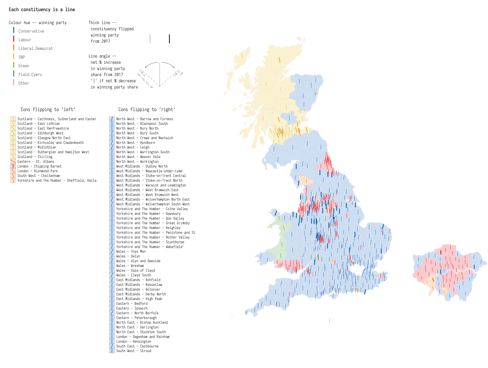
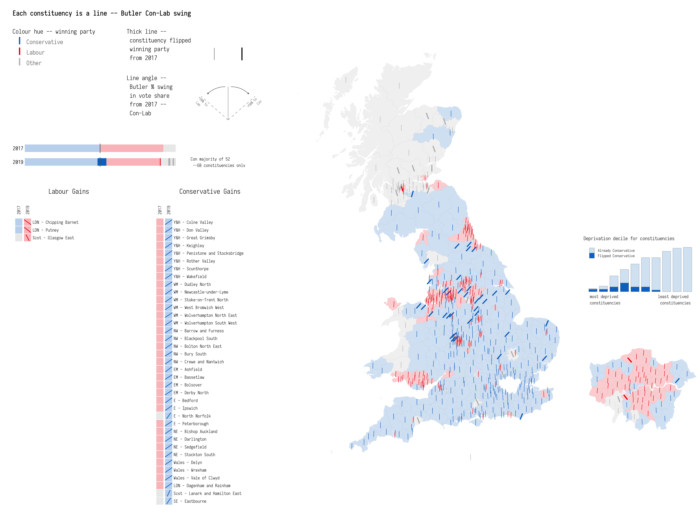
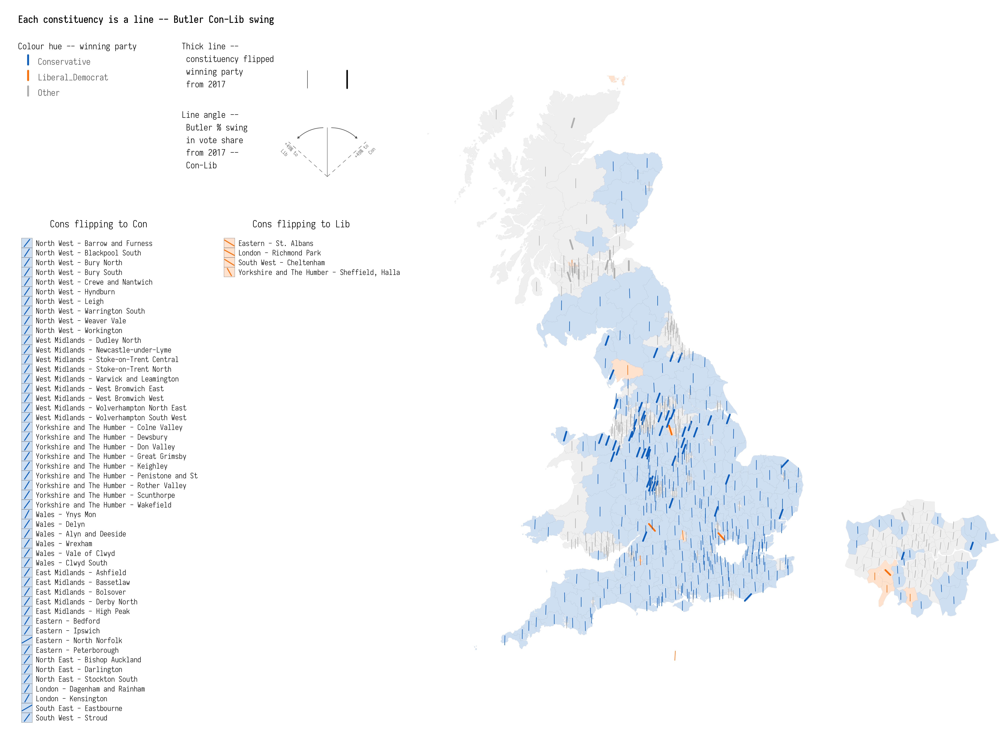
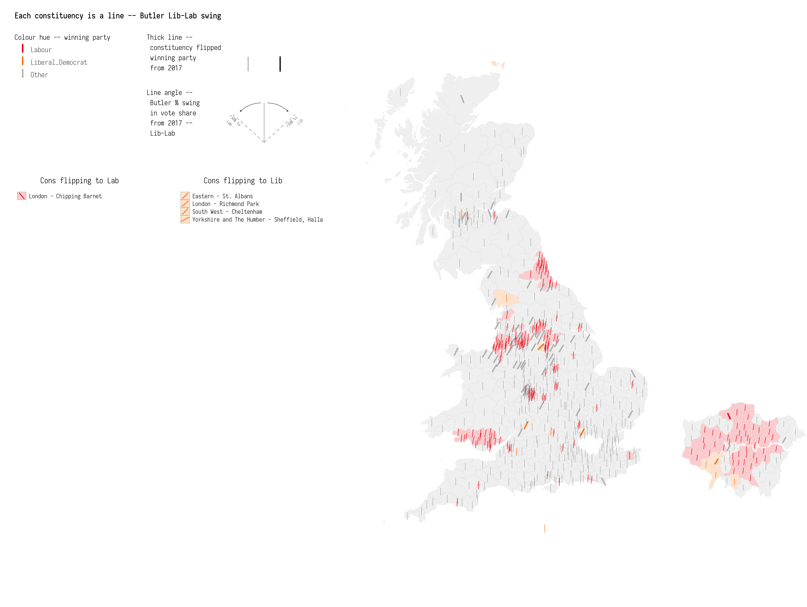

*Data vis of UK General Election 2019*
================
*Roger Beecham*
28/11/2019

## Context

This repository contains code and details for a data vis of 2019 UK
General Election. The encoding is based on [Lazaro
Gamio](https://twitter.com/LazaroGamio) and Dan Keating’s excellent work
[featured in Washington
Post](https://www.washingtonpost.com/graphics/politics/2016-election/election-results-from-coast-to-coast/)
analysing county-level voting outcomes for 2016 Presidential Election.

The data in this repository (found in [data/](data/)) is assembled from:

*Voting data*

  - [Electoral Commision](https://www.electoralcommission.org.uk) :
    constituency-level result data.

  - [YouGov](https://yougov.co.uk/topics/politics/articles-reports/2019/11/27/how-yougovs-2019-general-election-model-works)
    : constituency-level vote share estimates based on surveys from
    100,000 panellists and an MRP model. Methods by [Benjamin
    Lauderdale](http://benjaminlauderdale.net/) and [Jack
    Blumenau](https://www.jackblumenau.com/)

*Boundary data*

  - [ONS Open Geography Portal](http://geoportal.statistics.gov.uk) :
    Constituency boundary data.

-----



-----

## Required Libraries

``` r
library(tidyverse)              # bundle of packages for data manipulation. 
library(sf)                     # for working with geospatial data.

# theme_void makes view composition with annotate_custom and gridExtra easier.
theme_set(theme_void(base_family="Iosevka Light"))
```

## Load data

``` r
# Read in data from 2017 and 2015 from Electoral Commission.
data <- read_csv("./data/data.csv")

# Check consistency in winning party names between 2017 and 2015.
data %>% group_by(ons_code, year) %>%
  mutate(
    total_votes=sum(valid_votes), 
    first=max(valid_votes), 
    vote_share=valid_votes/total_votes, 
    is_first=if_else(valid_votes==first, 1, 0)
    ) %>% 
  select(ons_code, constituency, party, valid_votes, vote_share, total_votes, is_first) %>%
  filter(is_first==1, year) %>% ungroup() %>% select(party, year) %>% unique %>% View

# Recode speaker (Bercow) to Conservative
# Recode Democratic Unionist Party to DUP
# Recode Labour and Co-operative to Labour
# Recode Scottish National Party to SNP
# Recode UK Independence Party to UKIP
data <- data %>% mutate(
  party = case_when( 
    party == "Speaker" ~ "Conservative", # speaker (Bercow) to Conservative
    party == "Democratic Unionist Party" ~ "DUP", 
    party == "Labour and Co-operative" ~ "Labour", 
    party == "Scottish National Party" ~ "SNP",
    party == "UK Independence Party" ~ "UKIP",
    party == "Liberal Democrats" ~ "Liberal Democrat",
    party == "Social Democratic and Labour Party" ~ "SDLP",
    party == "Ulster Unionist Party" ~ "UUP",
    party == "Green Party" ~ "Green",
    TRUE ~ as.character(party)),
    party=gsub("\\s", "_", party)
) %>%
  # Remove columns that are not needed.
  select(-c(pano, surname, first_name))

# Load in YouGov's MRP-based estimates for GB constituencies 2019.
data_estimated <- read_csv("./data/party_constituency_vote_shares.csv") %>% 
  select(-c(X1,i)) %>% 
  # Rename parties for consistency with 2017 data.
  rename("Conservative"="Con", "Labour"="Lab", "Liberal_Democrat" = "LD", "Plaid_Cymru" = "PC") %>%
  # Reshape dataset so it can be joined with Electoral Commission data.
  # Treating vote_share as counts is an odd formulation but necessary for later
  # data processing activity.
  pivot_longer(-c(code, constituency), names_to="party", values_to="valid_votes") %>%
  # Add a year column and rename code to ons_code.
  add_column(year=2019) %>% rename("ons_code"="code")

# Load in outlines of consistuencies -- simplified using mapshapr.
constituency_boundaries <- st_read("./data/constituency_boundaries.geojson", crs=27700)

# Load in Region lookup.å
region_lookup <- read_csv("./data/constituency_region_lookup.csv")

# Check that winning parties in 2017 can be looked-up in winning parties for MRP data.
winners_2017 <- data %>% 
  # Filter non-GB consituencies
  inner_join(region_lookup %>% select(ons_code=PCON17CD,region_name=EER17NM)) %>%
  filter(region_name!="Northern Ireland", year==2017) %>%
  group_by(ons_code) %>%
  mutate(
    total_votes=sum(valid_votes), 
    first=max(valid_votes), 
    vote_share=valid_votes/total_votes, 
    is_first=if_else(valid_votes==first, 1, 0)
    ) %>% 
  select(ons_code, constituency, party, valid_votes, vote_share, total_votes, is_first) %>%
  filter(is_first==1) %>% ungroup() %>% select(party) %>% unique 

# Check that both match
(winners_2017 %>% pull(party)) %in% (data_estimated %>% pull(party) %>% unique)

# Check that winning parties in 2019 MRP data can be looked-up in winning parties 2017 data.
winners_2019 <- data %>% 
  group_by(ons_code) %>%
  mutate(
    total_votes=sum(valid_votes), 
    first=max(valid_votes), 
    is_first=if_else(valid_votes==first, 1, 0)
    ) %>% 
  filter(is_first==1) %>% ungroup() %>% select(party) %>% unique 

# Check that both match. 
# Note the Other category in the YouGov dataset.
(winners_2019 %>% pull(party)) %in% (data %>% pull(party) %>% unique)

# Recode the electoral commission data with Other category for consistency.
# Also remove 2015 data and non-GB constituencies.
data <- data %>% inner_join(region_lookup %>% select(ons_code=PCON17CD,region_name=EER17NM)) %>% filter(region_name!="Northern Ireland", year==2017) %>%
  mutate(party=if_else(party %in% estimated_parties_names, party, "Other")) %>% select(-region_name) %>%
  group_by(ons_code, constituency, year, party) %>%
  summarise(valid_votes=sum(valid_votes))

# Merge YouGov and electoral commision data
data <- bind_rows(data_estimated, data)
```

## Calculate derived measures for plotting

Calculate one-party shift and [Butler two party
swing](https://en.wikipedia.org/wiki/Swing_\(United_Kingdom\)#Original_mathematical_calculation)
for main parties for plotting.

``` r
data_plot <- data %>% group_by(ons_code, year) %>%
  mutate(
    total_votes=sum(valid_votes), 
    vote_share=valid_votes/total_votes, 
    elected_share=max(vote_share), 
    elected=if_else(vote_share==elected_share, party, "")) %>%  ungroup() %>%
  # Calculate one-party shift for party that was elected
  group_by(ons_code, party) %>%
  arrange(year, .by_group = TRUE) %>%
  mutate(
    elected_shift=if_else(elected==party, vote_share-lag(vote_share,1),0),
    # Identify whether winning party is flipped. 
    is_flipped=if_else(elected==party, !elected==lag(elected,1),NA)
    ) %>% ungroup() %>% 
  # Make wide again so that each column is a party.
  pivot_wider(names_from=party, values_from = vote_share) %>% 
  mutate_at(vars(Conservative:SNP), ~if_else(is.na(.x),0,.x)) %>%
  group_by(ons_code, year, elected, is_flipped) %>% 
  # Store derived values for the elected parties in constituency.
  summarise_at(vars(valid_votes, total_votes, elected_share, elected_shift, Conservative:SNP), ~max(.)) %>% ungroup () %>% 
  # Filter so one row for each constituency-year.
  filter(elected!="") %>% 
  # Calculate shift from 2017.
  group_by(ons_code) %>%  
  mutate_at(vars(Conservative:SNP), funs(shift=.-lag(.,1))) %>% 
  filter(year==2019) %>% rename("elected_votes"="valid_votes") %>% 
  # Calculate Butler two-party swing. 
  mutate(
    swing_con_lab=0.5*(Conservative_shift-Labour_shift),
    swing_con_lib=0.5*(Conservative_shift-Liberal_Democrat_shift),
    swing_lib_lab=0.5*(Liberal_Democrat_shift-Labour_shift)
  )

# There are six constituencies with ties.
# We're interested here in emphasising change where it exists, so we'll select
# as the *winning* vote-share that which involves a switch in party. 
data_plot <- data_plot %>% 
  group_by(ons_code) %>% 
  mutate(
    dup=n(), 
    is_tie=if_else(dup>1,TRUE,FALSE)) %>% ungroup() %>%
  filter(!is_tie | (is_tie & is_flipped)) %>%
  select(-c(is_tie, dup))
  
# Join with boundary data.
data_plot  <- constituency_boundaries %>% select(ons_code=pcon17cd, east=bng_e, north=bng_n, cons_name=pcon17nm) %>%
  inner_join(data_plot)
# And bring in region codes.
data_plot <- data_plot %>% left_join(region_lookup %>% select(region_name=EER17NM, PCON17CD), by=c("ons_code"="PCON17CD"))

# Manually set the speaker's constituency E14000637.
data_plot <- data_plot %>%
  mutate(
    is_flipped=if_else(ons_code=="E14000637",FALSE, is_flipped),
    elected_shift=if_else(ons_code=="E14000637",0, elected_shift))
```

## Colours

Selecting colours is challenging – I’m borrowing from
[Flourish’s](https://flourish.studio/2019/11/26/charts-for-the-uk-elections-2019/)
colour set.

``` r
# Con :
con <- "#0575c9"
# Lab :
lab <- "#ed1e0e"
# Lib dem : 
lib_dem <- "#fe8300"
# SNP : 
snp <- "#ebc31c"
# Greens : 
greens <- "#78c31e"
# plaid 
plaid <- "#4e9f2f"
# Other : 
other <- "#f3a6b2"

# Store as vector and recode plot data as factor for use in scale_colour_manual.
data_plot <- data_plot %>% 
  mutate(elected=fct_relevel(as_factor(elected), levels=c("Conservative","Labour","Liberal_Democrat","SNP", "Green", "Plaid_Cymru", "Other"))
)
colours <- c(con, lab, lib_dem, snp, greens, plaid, other)
names(colours) <- levels(data_plot$elected)
```

## Use of *geom\_spoke()*

To continuously vary line angle (as in [Washington Post
piece](https://www.washingtonpost.com/graphics/politics/2016-election/election-results-from-coast-to-coast/)),
I’m using `geom_spoke`. Couple of additional convenience functions are
below.

``` r
# Convert degrees to radians.
get_radians <- function(degrees) {
  (degrees * pi) / (180)
}
# Rescaling function.
map_scale <- function(value, min1, max1, min2, max2) {
  return  (min2+(max2-min2)*((value-min1)/(max1-min1)))
}

# Position subclass for centered geom_spoke as per --
# https://stackoverflow.com/questions/55474143/how-to-center-geom-spoke-around-their-origin
position_center_spoke <- function() PositionCenterSpoke
PositionCenterSpoke <- ggplot2::ggproto('PositionCenterSpoke', ggplot2::Position,
    compute_panel = function(self, data, params, scales) {
      data$x <- 2*data$x - data$xend
      data$y <- 2*data$y - data$yend
      data$radius <- 2*data$radius
      data
  }
)
```

## Generate legend with *annotation\_custom()*

``` r
# Use of angle to encode swing.
swing <-  ggplot()+
  geom_spoke(aes(x=0, y=-.35,angle=get_radians(90)),radius=0.55, size=0.2, colour="#636363")+
  geom_spoke(aes(x=0, y=-.35,angle=get_radians(135)),radius=0.55, size=0.2,colour="#636363", linetype = "dashed")+
  geom_spoke(aes(x=0, y=-.35,angle=get_radians(45)),radius=0.55,size=0.2,colour="#636363",linetype = "dashed")+
  geom_text(aes(label="+17% to \n Con",x=.45, y=0), angle=45,hjust="right", family="Iosevka Light", size=2, colour="#636363")+
  geom_text(aes(label="+17% to \n Lab, Lib, Grn, SNP",x=-.45, y=0), angle=315,hjust="left", family="Iosevka Light", size=2, colour="#636363")+
  geom_curve(aes(x=-.04, y=.2, xend=-.3, yend=.08), size=0.3, curvature = 0.2, arrow=arrow(type="closed", length = unit(.03, "inches")), colour="#636363")+
  geom_curve(aes(x=.04, y=.2, xend=.3, yend=.08), size=0.3, curvature = -0.2, arrow=arrow(type="closed", length = unit(.03, "inches")), colour="#636363")+
  xlim(-0.5,0.5)+
  ylim(-0.35,0.35)
# Use of colour to encode party.
temp_dat <-tibble(
  elected=names(colours[1:7]),
  y=rev(1:length(colours[1:7])),
  x=rep(1,length(colours[1:7]))
) 
party <- temp_dat %>% 
  ggplot()+
  geom_spoke(aes(x=x, y=y,angle=get_radians(90), colour=elected),radius=0.6, size=1)+
  scale_colour_manual(values=colours)+
  geom_text(aes(label=elected,x=x+0.05, y=y+0.2),hjust="left",vjust="middle", family="Iosevka Light", size=3.5, colour="#636363")+
    guides(colour=FALSE)+
  xlim(1,2)+
  ylim(1,8)
# Use of thickness to flips.
line <-  ggplot()+
  geom_spoke(aes(x=-0.2, y=-.35,angle=get_radians(90)),radius=0.55, size=0.2)+
  geom_spoke(aes(x=0.2, y=-.35,angle=get_radians(90)),radius=0.55, size=0.8)+
  xlim(-0.5,0.5)+
  ylim(-0.35,0.35)
  
legend <- ggplot()+
  geom_text(aes(label="Each constituency is a line",x=0, y=6), hjust="left", vjust="top", family="Iosevka Medium", size=4)+
  geom_text(aes(label="Colour hue -- winning party",x=0, y=5), hjust="left", vjust="top", family="Iosevka Light", size=3.5)+
  geom_text(aes(label="Thick line -- \n constituency flipped \n winning party \n from 2017",x=4.5, y=5), hjust="left", vjust="top", family="Iosevka Light", size=3.5)+
  geom_text(aes(label="Line angle -- \n net % increase \n in winning party \n share from 2017 \n '|' if % - in share",x=4.5, y=2.5), hjust="left", vjust="top", family="Iosevka Light", size=3.5)+
  annotation_custom(grob=ggplotGrob(swing),xmin=7,xmax=10,ymin=0,ymax=2.5)+
  annotation_custom(ggplotGrob(line),xmin=7,xmax=10,ymin=4.2,ymax=3.3)+
  annotation_custom(ggplotGrob(party),xmin=0,xmax=6,ymin=0,ymax=5)+
  xlim(0,10)+
  ylim(0,6.25)
```

## Generate map with *geom\_spoke()* and *geom\_sf()*

``` r
# Only shift overall vote if the winning party sees an increase in vote-share
max_shift <- max(data_plot$elected_shift)
min_shift <- -max_shift
# Calculate bounding boxes for use in annotation_custom().
london_bbox <- st_bbox(data_plot %>% filter(region_name=="London"))
london_width <- unname(london_bbox$xmax)-unname(london_bbox$xmin) 
london_height <- unname(london_bbox$ymax)-unname(london_bbox$ymin) 
london_aspect <- london_width/london_height
uk_bbox <- st_bbox(data_plot)
uk_width <- unname(uk_bbox$xmax)-unname(uk_bbox$xmin) 
uk_height <- unname(uk_bbox$ymax)-unname(uk_bbox$ymin) 
# GB map.
gb <- data_plot %>%
  filter(region_name!="London") %>%
  ggplot()+
  geom_sf(aes(fill=elected), colour="#636363", alpha=0.2, size=0.01)+
  coord_sf(crs=27700, datum=NA, xlim = c(unname(uk_bbox$xmin), unname(uk_bbox$xmax)+5*london_width), ylim = c(unname(uk_bbox$ymin), unname(uk_bbox$ymax)-0.22*uk_height))+
  # Flipped
  geom_spoke(data=.%>% filter(is_flipped, elected %in% c("Conservative")),
     aes(x=east, y=north, angle=get_radians(map_scale(pmax(elected_shift,0),min_shift,max_shift,135,45)), colour=elected), radius=8000, size=0.9, position="center_spoke")+
  geom_spoke(data=. %>% filter(is_flipped, !elected %in% c("Conservative")),
     aes(x=east, y=north, angle=get_radians(map_scale(pmax(elected_shift,0),min_shift,max_shift,45,135)), colour=elected), radius=8000, size=0.9, position="center_spoke")+
  # Not flipped
   geom_spoke(data=. %>% filter(!is_flipped, elected %in% c("Conservative")),
     aes(x=east, y=north, angle=get_radians(map_scale(pmax(elected_shift,0),min_shift,max_shift,135,45)), colour=elected), radius=8000, size=0.4, position="center_spoke")+
  geom_spoke(data=. %>% filter(!is_flipped, !elected %in% c("Conservative")),
     aes(x=east, y=north, angle=get_radians(map_scale(pmax(elected_shift,0),min_shift,max_shift,45,135)), colour=elected), radius=8000, size=0.4, position="center_spoke")+
  scale_colour_manual(values=colours)+
  scale_fill_manual(values=colours)+
    guides(colour=FALSE, fill=FALSE)

london <- data_plot %>%
  filter(region_name=="London") %>%
  ggplot()+
  geom_sf(aes(fill=elected), colour="#636363", alpha=0.2, size=0.01)+
  coord_sf(datum=NA)+
  # Flipped
  geom_spoke(data=.%>% filter(is_flipped, elected %in% c("Conservative")),
     aes(x=east, y=north, angle=get_radians(map_scale(pmax(elected_shift,0),min_shift,max_shift,135,45)), colour=elected), radius=8000/6, size=0.9, position="center_spoke")+
  geom_spoke(data=.%>% filter(is_flipped, !elected %in% c("Conservative")),
     aes(x=east, y=north, angle=get_radians(map_scale(pmax(elected_shift,0),min_shift,max_shift,45,135)), colour=elected), radius=8000/6, size=0.9, position="center_spoke")+
  # Not flipped
   geom_spoke(data=.%>% filter(!is_flipped, elected %in% c("Conservative")),
     aes(x=east, y=north, angle=get_radians(map_scale(pmax(elected_shift,0),min_shift,max_shift,135,45)), colour=elected), radius=8000/6, size=0.4, position="center_spoke")+
  geom_spoke(data=.%>% filter(!is_flipped, !elected %in% c("Conservative")),
     aes(x=east, y=north, angle=get_radians(map_scale(pmax(elected_shift,0),min_shift,max_shift,45,135)), colour=elected), radius=8000/6, size=0.4, position="center_spoke")+
  scale_colour_manual(values=colours)+
  scale_fill_manual(values=colours)+
  guides(colour=FALSE, fill=FALSE)

map <- gb +
 annotation_custom(
      grob=ggplotGrob(london),
      xmin=unname(uk_bbox$xmax +1*london_width),
      xmax=unname(uk_bbox$xmax) + 6*london_width,
      ymin=unname(uk_bbox$ymin) +1*london_height,
      ymax=unname(uk_bbox$ymin) + 6*london_height
  )
```

## Generate summary of flips

``` r
flips_data <- data_plot %>% 
  filter(is_flipped) %>% 
  group_by(region_name, elected) %>% 
  mutate(
    number_flips=n(),
    flip_direction = if_else(elected %in% c("Conservative"),"Cons flipping to 'right'","Cons flipping to 'left'")
  ) %>% ungroup() %>% 
  group_by(flip_direction) %>% 
  # For constituencies ordered by flip_direction and regions with greatest number of flips
  # occuring first
  arrange(flip_direction, desc(number_flips)) %>% mutate(row=row_number()) %>% ungroup() %>% 
  mutate(facet_rows= case_when(row / 100 <1 ~ 1,row / 100 <2 ~ 2),
         max_row=max(row))

flips <- flips_data %>%
  ggplot()+
   geom_rect(aes(xmin=0.7, xmax=1.3, ymin=-row-0.5, ymax=-row+0.5, fill=elected),colour="#636363", size=0.1, alpha=0.2)+
  # Flipped
   geom_spoke(data=. %>% filter(is_flipped, elected %in% c("Conservative")),
     aes(x=1, y=-row, angle=get_radians(map_scale(pmax(elected_shift,0),min_shift,max_shift,135,45)), colour=elected), radius=0.4, size=0.5, position="center_spoke")+
    geom_spoke(data=. %>% filter(is_flipped==TRUE, !elected %in% c("Conservative")),
       aes(x=1, y=-row, angle=get_radians(map_scale(pmax(elected_shift,0),min_shift,max_shift,45,135)), colour=elected), radius=0.4, size=0.5, position="center_spoke")+
  geom_text(aes(x=1.5, y=-row, label=paste0(region_name," - ",cons_name)), hjust="left", size=3, family="Iosevka Light")+
 geom_text(data=. %>% filter(flip_direction=="Cons flipping to 'right'") %>% slice(1), aes(label=flip_direction), x=5, y=1, hjust="centre", family="Iosevka Light") +
  geom_text(data=. %>% filter(flip_direction=="Cons flipping to 'left'") %>% slice(1), aes(label=flip_direction), x=5, y=1, hjust="centre", family="Iosevka Light") +
  xlim(0,10)+
  ylim(-(max(flips_data$max_row)+1), 2)+
  facet_wrap(~flip_direction)+
   scale_colour_manual(values=colours)+
  scale_fill_manual(values=colours)+
  guides(colour=FALSE, fill=FALSE)+
  theme(strip.text = element_blank())
```

## Compose views and export

View composition in `ggplot2` is not as easier and elegant as in
[vega-lite](https://vega.github.io/vega-lite/), but I’m using
`gridExtra::grid.arrange()` and some fiddly trial and error work.

``` r
out <- gridExtra::grid.arrange(legend,flips,map,
                    widths = c(0.4, 0.6),
                    heights = c(0.25,0.75),
                    layout_matrix = rbind(c(1,3), c(2,3))
)
ggsave("./figures/all_yg.png",plot = out, width=40, height=30.15, units="cm")
```


